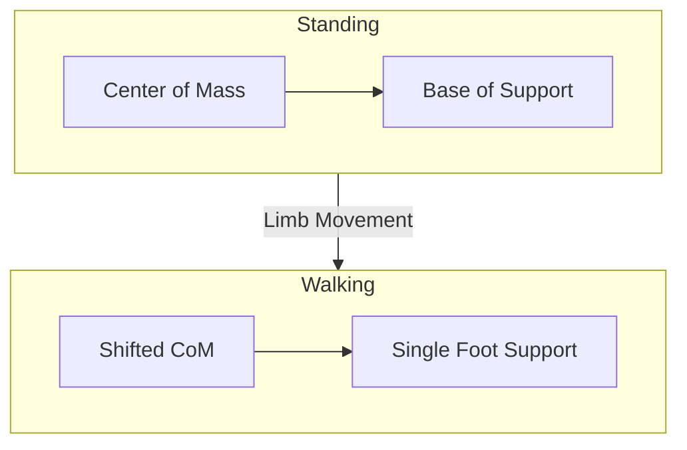

import Callout from '@site/src/components/Callout';
import Quiz from '@site/src/components/Quiz';
import Exercise from '@site/src/components/Exercise';

## Learning Objectives

By the end of this chapter, you will:
- Configure Gazebo physics engines (ODE, Bullet, DART) for different simulation requirements
- Model accurate inertial properties and gravitational effects for humanoid robots
- Implement collision detection and response systems for safe robot simulation
- Design joint constraints and motor simulations for realistic robot actuation

## Physics Engine Fundamentals in Gazebo

Gazebo provides multiple physics engine options, each offering different capabilities for rigid body simulation:

- ODE (Open Dynamics Engine)
- Bullet
- DART (Dynamic Animation and Robotics Toolkit)

For humanoid robotics applications, the choice of physics engine significantly affects simulation accuracy, performance, and stability. This is particularly important for complex multi-body systems with numerous joints and contacts that characterize humanoid robots.

<Callout type="tip" title="Physics Engine Selection">
For humanoid robots, DART is often preferred for its superior constraint solving capabilities, while Bullet provides better contact modeling for manipulation tasks.
</Callout>

### Concrete Examples
- Example: Configuring ODE physics engine parameters for stable bipedal locomotion simulation
- Example: Setting up collision geometry for a humanoid robot's foot to accurately simulate ground contact

ODE serves as the default physics engine in many Gazebo installations, providing stable simulation for articulated systems with good performance characteristics. For humanoid robots, ODE offers robust contact modeling and constraint solving capabilities suitable for bipedal locomotion and manipulation tasks.

However, ODE has certain limitations when applied to complex humanoid models:
- Handling complex contact scenarios with multiple simultaneous contacts
- May require careful parameter tuning for optimal performance with complex humanoid models

<Quiz
  question="Which of the following is NOT a physics engine available in Gazebo?"
  options={[
    "ODE (Open Dynamics Engine)",
    "Bullet",
    "DART (Dynamic Animation and Robotics Toolkit)",
    "MuJoCo"
  ]}
  correctAnswer={3}
  explanation="Gazebo provides ODE, Bullet, and DART as physics engines. MuJoCo is a separate physics engine used in other simulation environments."
/>

Bullet physics engine provides more advanced capabilities compared to ODE, particularly in collision detection and contact modeling. This makes it especially suitable for scenarios requiring high-fidelity contact simulation.

For humanoid robots, Bullet's superior contact handling can significantly improve the realism of:
- Foot-ground contact during walking and balance control
- Manipulation contact during grasping and object manipulation tasks

The engine also provides better support for complex geometric shapes and compound collisions, making it valuable for detailed humanoid robot simulations.

DART (Dynamic Animation and Robotics Toolkit) offers advanced features specifically designed for articulated rigid body simulation, with superior constraint solving capabilities and enhanced stability characteristics.

For humanoid robots, DART provides excellent support for complex kinematic chains and demonstrates the ability to handle the numerous joints and contacts typical of humanoid robot models more robustly than other engines. DART is particularly well-suited for simulation of complex humanoid locomotion and manipulation behaviors, making it an ideal choice for advanced humanoid robotics applications.

<Exercise
  title="Physics Engine Configuration"
  problem="Configure a Gazebo world file to use the Bullet physics engine with appropriate parameters for humanoid robot simulation."
  hints={[
    "Use the <physics> tag in the world file",
    "Set the type attribute to 'bullet'",
    "Configure appropriate solver parameters"
  ]}
  solution={`<?xml version="1.0" ?>
<sdf version="1.7">
  <world name="humanoid_simulation">
    <physics type="bullet">
      <max_step_size>0.001</max_step_size>
      <real_time_factor>1.0</real_time_factor>
      <real_time_update_rate>1000</real_time_update_rate>
      <gravity>0 0 -9.8</gravity>
      <solver>
        <type>sequential_impulse</type>
        <iters>100</iters>
        <sor>1.3</sor>
      </solver>
      <constraints>
        <cfm>0.0</cfm>
        <erp>0.2</erp>
        <contact_surface_layer>0.001</contact_surface_layer>
        <contact_max_correcting_vel>100.0</contact_max_correcting_vel>
      </constraints>
    </physics>
  </world>
</sdf>`}
/>

## Gravity and Inertial Properties Modeling

Accurate modeling of gravity and inertial properties is fundamental to achieving realistic humanoid robot simulation. These properties directly affect the robot's dynamic behavior and overall stability during simulation.

The gravitational constant and direction must be properly configured to match the intended operating environment, typically Earth's standard gravity of 9.8 m/s² directed downward along the negative Z-axis.

Individual link inertial properties must accurately reflect the physical robot's actual mass distribution to ensure realistic simulation results.

Inertial properties for each robot link include three critical components:
- Mass: The total mass of the link
- Center of mass: The point where the link's mass is concentrated
- The inertia tensor: A mathematical representation describing how mass is distributed relative to the link's coordinate frame

For humanoid robots, these properties must be carefully calculated or measured for each body segment, including the torso, limbs, and head components. This comprehensive approach ensures that the simulated robot behaves similarly to its physical counterpart.

The accuracy of inertial modeling directly impacts the realism of locomotion, balance control, and manipulation behaviors developed in simulation. Proper inertial properties are essential for developing control strategies that will transfer effectively from simulation to the physical robot.

<Callout type="warning" title="Inertial Accuracy">
For humanoid robots, inaccurate inertial modeling can lead to control strategies that work in simulation but fail on the physical robot, potentially causing damage or unsafe behavior.
</Callout>

The center of mass location critically affects the robot's balance and stability characteristics, which is particularly important for bipedal locomotion in humanoid robots.

Proper center of mass modeling ensures that balance control algorithms developed in simulation will transfer appropriately to the physical robot, maintaining safety and performance during real-world deployment.

For humanoid robots, the center of mass location changes dynamically as limbs move through their range of motion. This dynamic behavior requires careful consideration during both simulation setup and control system design to ensure realistic and stable robot behavior.

*Figure: Diagram showing how the center of mass shifts as humanoid robot limbs move, affecting balance and stability*

Inertia tensors describe how mass is distributed throughout each link and how the robot responds to applied torques, making them critical for realistic simulation of motion dynamics in humanoid robots.

Accurate inertia tensors are especially important during rapid movements and when external forces are applied, as they determine how the robot will react to these dynamic conditions.

The inertia tensor must be properly aligned with the link's coordinate frame and reflect the actual mass distribution of the physical component. Proper alignment ensures that rotational dynamics are accurately simulated, which is essential for stable and realistic robot behavior during complex maneuvers.

## Collision Detection and Response Systems

Collision detection and response systems in Gazebo determine how robot components interact with:
- Each other
- The environment

These form a critical component of realistic simulation for humanoid robots.

The collision system must handle numerous simultaneous contacts:
- Self-collision
- Environment collision
- Contact with objects during manipulation tasks.

<Quiz
  question="What is the primary purpose of self-collision detection in humanoid robot simulation?"
  options={[
    "To improve rendering quality",
    "To prevent humanoid robot limbs from passing through each other during complex motion sequences",
    "To reduce simulation performance",
    "To increase the number of joints"
  ]}
  correctAnswer={1}
  explanation="Self-collision detection prevents humanoid robot limbs from passing through each other during complex motion sequences, which is critical for realistic simulation."
/>

Gazebo's collision detection system uses geometric approximations of robot shapes and environment shapes to efficiently detect potential collisions. For humanoid robots, collision geometry typically uses simplified shapes such as boxes, cylinders, spheres, and capsules. These approximate the actual robot geometry while maintaining computational efficiency for real-time simulation.

The collision geometry must be carefully designed to provide accurate collision detection while avoiding excessive computational overhead that could slow down the simulation.

Contact response modeling determines how forces are applied when collisions occur, directly affecting the robot's dynamic behavior during contact scenarios. For humanoid robots, contact response must accurately model foot-ground contact during walking, hand-object contact during manipulation, and any other physical interactions that occur during robot operation.

The contact parameters, including friction coefficients and restitution values, must be carefully tuned to match the physical properties of the real-world materials used in the actual robot and environment. This ensures that the simulation accurately reflects real-world physics.

Self-collision detection prevents humanoid robot limbs from passing through each other during complex motion sequences, which is essential for maintaining realistic robot behavior.

For humanoid robots with numerous degrees of freedom, self-collision detection must efficiently identify potential collisions between all possible link pairs while maintaining real-time performance. The collision system must also provide appropriate contact forces to prevent penetration while still allowing for realistic motion patterns.

## Joint Constraints and Motor Simulation

Joint constraints in Gazebo define the allowed motion between connected robot links, implementing the kinematic relationships that characterize humanoid robot structures. These constraints are fundamental to creating realistic robot models that behave similarly to their physical counterparts.

For humanoid robots, joint constraints must accurately model the range of motion, friction characteristics, and dynamic characteristics of physical joints to ensure realistic simulation of robot behaviors.

Joint limit constraints prevent humanoid robot joints from exceeding their physical range of motion, protecting both the simulated robot model and ensuring realistic behavior that matches the physical limitations of the actual robot.

For humanoid robots, joint limits must precisely reflect the actual mechanical constraints of the physical robot, including soft limits for safety margins and hard limits for mechanical protection. This accurate modeling is essential for developing control algorithms that will work properly on the physical robot.

Proper joint limit modeling prevents damage to both simulated robots during testing and physical robots during control algorithm development, ensuring that the behaviors developed in simulation will transfer safely to real-world applications.

<Exercise
  title="Joint Limit Configuration"
  problem="Define a URDF joint with appropriate limits for a humanoid robot's knee joint."
  hints={[
    "Use the <joint> tag with type attribute",
    "Include <limit> sub-element with min/max values",
    "Consider the physical constraints of a human knee"
  ]}
  solution={`<joint name="knee_joint" type="revolute">
  <parent link="thigh_link"/>
  <child link="shin_link"/>
  <origin xyz="0 0 -0.4" rpy="0 0 0"/>
  <axis xyz="0 1 0"/>
  <limit lower="-0.05" upper="2.356" effort="500" velocity="10"/>
  <dynamics damping="1.0" friction="0.1"/>
</joint>`}
/>

Motor simulation in Gazebo provides actuator models that approximate the dynamic response of physical motors, including torque limits, velocity limits, and motor dynamics. For humanoid robots, accurate motor simulation is essential for developing realistic control algorithms that will transfer effectively to physical robots.

The motor models must account for various factors including motor time constants, gear ratios, and friction characteristics that affect the actual performance of physical actuators.

Joint friction modeling significantly affects the realism of robot motion and the accuracy of control algorithm development. For humanoid robots, friction modeling must account for both static friction characteristics of physical joints (which resist initial motion) and dynamic friction characteristics of physical joints (which affect motion once it has started).

Accurate friction modeling can significantly affect walking stability and manipulation precision, making it crucial for developing effective humanoid robot control systems. Proper friction modeling ensures that control strategies developed in simulation will perform appropriately on physical robots, preventing unexpected behaviors during real-world deployment.

<Callout type="danger" title="Friction Modeling">
Improper friction modeling can lead to control strategies that work in simulation but fail on the physical robot, potentially causing damage or unsafe behavior.
</Callout>

## Practical Applications in Humanoid Robotics

In humanoid robotics, proper physics simulation is essential for developing and testing complex behaviors before deploying them on real robots. The physics parameters configured in simulation directly impact how well control algorithms transfer from simulation to reality, making accurate modeling crucial for successful real-world deployment.

When setting up a humanoid robot simulation, several key considerations ensure effective and realistic results:
1. Selecting the appropriate physics engine for your robot's specific requirements and application needs
2. Configuring accurate inertial properties that precisely match your physical robot's specifications
3. Implementing proper collision geometry that captures all essential physical interactions
4. Creating realistic joint constraints and motor models that accurately reflect the physical limitations of the actual robot

These elements work together synergistically to create a high-fidelity simulation environment where you can safely test complex behaviors like walking, balancing, and manipulation without risking damage to the physical robot or creating unsafe conditions during development and testing.

## Ethical & Safety Considerations

The accuracy of rigid body dynamics simulation in humanoid robotics has important ethical and safety implications for real-world robot deployment. These considerations are fundamental to responsible robotics development and deployment.

Inaccurate physics simulation can lead to unsafe control strategies that perform acceptably in simulation but result in dangerous behaviors when deployed on physical robots. This poses significant risks to both human safety and property, making accurate simulation a critical ethical responsibility.

Proper validation of physics models is essential to ensure that simulated safety behaviors translate accurately to real-world operation. This validation process must be thorough and comprehensive to maintain the safety and reliability of humanoid robot systems.

Additionally, the realistic simulation of robot dynamics enables comprehensive safety testing before physical deployment, which significantly reduces risks to humans and property. This proactive approach to safety testing is an ethical imperative in humanoid robotics development.

## Summary

In this chapter, we've explored the fundamental concepts of rigid body dynamics in Gazebo and their critical applications in humanoid robotics:

- **Gazebo provides multiple physics engines** (ODE, Bullet, DART) with different capabilities for humanoid robot simulation, each offering unique advantages for specific applications
- **Accurate inertial properties modeling** is essential for realistic robot dynamics and balance control, directly affecting how well control strategies transfer from simulation to reality
- **Collision detection systems** must handle self-collision, environment collision, and manipulation contacts with precision to ensure realistic robot behavior
- **Joint constraints and motor simulation** must accurately reflect physical robot characteristics to enable effective control algorithm development
- **Proper physics modeling** enables safe validation of robot behaviors before real-world deployment, reducing risks and improving safety
- **Friction and contact modeling** significantly impact the transferability of control strategies from simulation to reality, making accurate modeling crucial for successful deployment

The rigid body dynamics concepts covered in this chapter are essential for creating realistic simulation environments for your Autonomous Humanoid capstone project. The physics engine configuration skills you've learned will be used to optimize simulation performance and accuracy for your specific robot model. The collision detection and response systems will ensure safe and realistic robot behavior during testing of locomotion and manipulation behaviors in simulation. Understanding these principles is fundamental to developing humanoid robots that can safely and effectively operate in real-world environments.