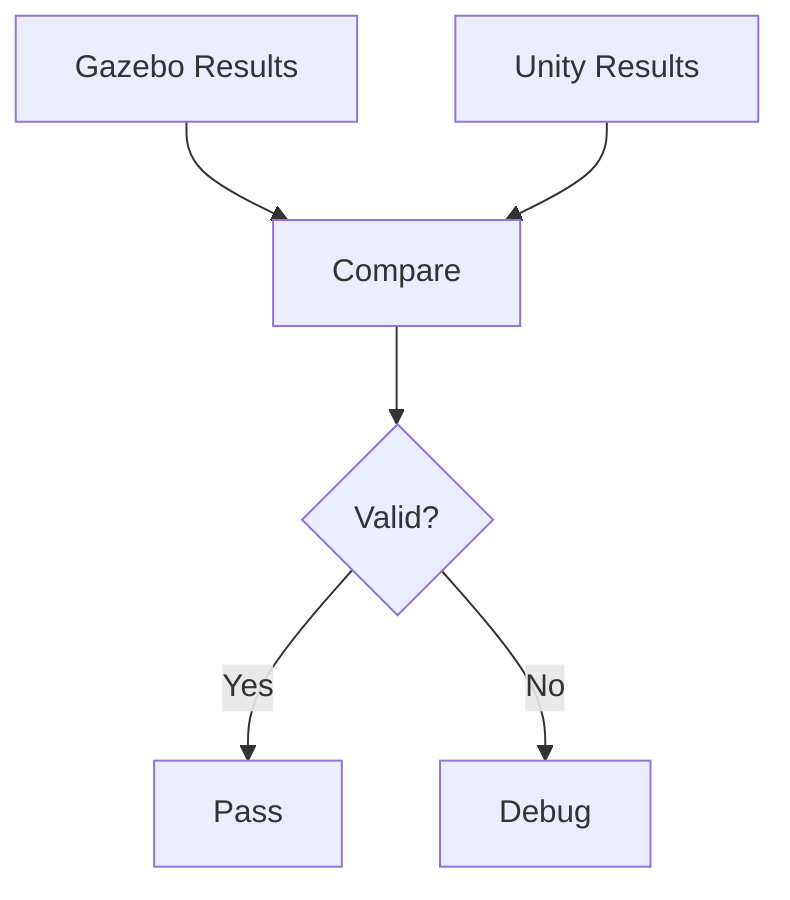

import Callout from '@site/src/components/Callout';
import Quiz from '@site/src/components/Quiz';
import Exercise from '@site/src/components/Exercise';

## Learning Objectives

By the end of this chapter, you will:
- Implement bidirectional data exchange between Gazebo and Unity simulators
- Design synchronization strategies for maintaining consistency across simulators
- Optimize performance for real-time simulation workflows
- Validate simulation accuracy and consistency across synchronized environments

## Data Exchange Between Simulators

Bidirectional data exchange between Gazebo and Unity forms the foundation of synchronized simulation environments for humanoid robotics. It enables the transfer of state information, sensor data, and control commands between the two platforms. For humanoid robots, this data exchange must handle complex articulated models, sensor data streams, and real-time control requirements while maintaining the accuracy and timing characteristics required for realistic simulation.

<Callout type="tip" title="Bidirectional Exchange">
Bidirectional data exchange enables the transfer of state information, sensor data, and control commands between Gazebo and Unity, forming the foundation of synchronized simulation environments for humanoid robotics.
</Callout>

State synchronization involves maintaining consistent representations of robot and environment states across both simulators. This ensures that the same physical configuration is represented in both Gazebo and Unity. For humanoid robots with numerous degrees of freedom, this requires efficient transmission of joint angles, link poses, and dynamic states using appropriate update frequencies to maintain visual and physical consistency. The synchronization must account for the different physics engines and rendering pipelines used by each simulator.

*Figure: Diagram showing the state synchronization process between Gazebo and Unity simulators for humanoid robot simulation*

Sensor data exchange enables the sharing of simulated sensor information between platforms. This allows Unity to provide high-fidelity rendering for camera sensors while Gazebo provides accurate physics-based sensor simulation. For humanoid robots, this includes the exchange of camera images, depth maps, LiDAR point clouds, and other sensor modalities between the simulators. The data exchange must maintain temporal consistency and appropriate data formats enabling seamless integration with ROS 2 sensor processing pipelines.

<Exercise
  title="Sensor Data Exchange Implementation"
  problem="Implement a sensor data exchange system between Gazebo and Unity for a humanoid robot's camera sensor."
  hints={['Use ROS 2 topics for data transmission', 'Implement appropriate data format conversion', 'Handle timing synchronization between simulators']}
  solution={`// Example implementation of sensor data exchange between Gazebo and Unity:

// In Gazebo plugin:
#include <gazebo/gazebo.hh>
#include <gazebo/sensors/CameraSensor.hh>
#include <sensor_msgs/msg/image.hpp>
#include <rclcpp/rclcpp.hpp>

class GazeboCameraBridge : public gazebo::SensorPlugin
{
public:
  void Load(gazebo::sensors::SensorPtr _sensor, sdf::ElementPtr _sdf) override
  {
    this->cameraSensor = std::dynamic_pointer_cast<gazebo::sensors::CameraSensor>(_sensor);

    // Initialize ROS 2 publisher
    this->node = rclcpp::Node::make_shared("gazebo_camera_bridge");
    this->pub = this->node->create_publisher<sensor_msgs::msg::Image>("/unity/camera_image", 10);

    // Connect to camera update event
    this->updateConnection = this->cameraSensor->ConnectUpdated(
      std::bind(&GazeboCameraBridge::OnNewFrame, this));
  }

  void OnNewFrame()
  {
    auto image = this->cameraSensor->ImageData();
    sensor_msgs::msg::Image msg;
    // Convert image data to ROS message format
    // Publish to Unity via ROS 2
    this->pub->publish(msg);
  }

private:
  gazebo::sensors::CameraSensorPtr cameraSensor;
  rclcpp::Node::SharedPtr node;
  rclcpp::Publisher<sensor_msgs::msg::Image>::SharedPtr pub;
  gazebo::event::ConnectionPtr updateConnection;
};`}
/>

Control command synchronization ensures that control inputs applied in one simulator are properly reflected in the other. This enables operators or control algorithms to interact with the synchronized environment through either platform. For humanoid robots, this includes joint commands, velocity commands, and other control modalities that must be consistently applied across both simulators to maintain synchronized behavior.

### Concrete Examples
- Example: Synchronizing joint states between Gazebo physics and Unity rendering for humanoid robot
- Example: Sharing camera sensor data from Unity to Gazebo for perception pipeline integration

<Quiz
  question="What is the primary purpose of state synchronization between Gazebo and Unity?"
  options={['To improve rendering quality only', 'To maintain consistent representations of robot and environment states across both simulators', 'To reduce simulation performance', 'To create 3D models in Unity']}
  correctAnswer={1}
  explanation="State synchronization ensures that the same physical configuration is represented in both Gazebo and Unity, maintaining consistent robot and environment states across both simulators."
/>

## Synchronization Strategies

Synchronization strategies for Gazebo-Unity integration must balance accuracy, performance, and consistency while maintaining realistic simulation behavior across both platforms. For humanoid robots, the synchronization approach must handle the complex dynamics of articulated systems and maintain the timing requirements for real-time control and perception systems.

<Callout type="note" title="Strategy Balance">
Synchronization strategies must balance accuracy, performance, and consistency while maintaining realistic simulation behavior across both Gazebo and Unity platforms for humanoid robots.
</Callout>

Time-based synchronization aligns the simulation time across both platforms. This ensures that both simulators advance at the same rate and maintain consistent temporal relationships. For humanoid robots, time synchronization is critical as it maintains the accuracy of dynamic behaviors such as walking. Timing relationships between different joints and control loops are essential for stable locomotion. The synchronization must handle both real-time and accelerated simulation modes while maintaining accuracy.

*Figure: Diagram comparing time-based and state-based synchronization approaches for Gazebo-Unity integration*

State-based synchronization focuses on maintaining consistent spatial and dynamic states between simulators. Updates are triggered by state changes rather than time intervals. For humanoid robots, this approach can be more efficient for scenarios where the robot is in static poses or moving slowly. Updates are only transmitted when significant state changes occur. The state-based approach must include appropriate thresholds and filtering to avoid excessive updates while maintaining accuracy.

<Exercise
  title="Time-Based Synchronization Implementation"
  problem="Implement a time-based synchronization system between Gazebo and Unity for humanoid robot simulation."
  hints={['Use a common time reference across both simulators', 'Implement time synchronization messages', 'Handle timing drift and compensation']}
  solution={`// Example implementation of time-based synchronization:

// Time synchronization message structure
struct TimeSyncMessage
{
  double gazebo_time;    // Current simulation time in Gazebo
  double unity_time;     // Current simulation time in Unity
  double timestamp;      // Message timestamp
  int sequence_number;   // Message sequence number
};

// Synchronization algorithm
class TimeSynchronizer
{
private:
  double gazebo_time_offset;
  double unity_time_offset;
  double last_sync_time;

public:
  void SyncTimestamps(double gazebo_time, double unity_time)
  {
    // Calculate time offsets to align simulation clocks
    double current_offset = gazebo_time - unity_time;

    // Apply smoothing to reduce jitter
    gazebo_time_offset = 0.9 * gazebo_time_offset + 0.1 * current_offset;

    // Adjust simulation time in Unity based on calculated offset
    double adjusted_unity_time = unity_time + gazebo_time_offset;

    // Send time adjustment command to Unity
    SendTimeAdjustment(adjusted_unity_time);
  }
};`}
/>

Predictive synchronization uses mathematical models to predict future states. This reduces the impact of network latency on synchronization accuracy. For humanoid robots, predictive synchronization can help maintain consistent behavior when network delays affect the synchronization process. This is particularly important for real-time control applications. The predictive models must account for the complex dynamics of humanoid robot systems.

### Concrete Examples
- Example: Implementing time-based synchronization for humanoid walking gait simulation
- Example: Using state-based synchronization for efficient static pose maintenance

<Quiz
  question="Which synchronization strategy triggers updates based on state changes rather than time intervals?"
  options={['Time-based synchronization', 'State-based synchronization', 'Predictive synchronization', 'Event-based synchronization']}
  correctAnswer={1}
  explanation="State-based synchronization focuses on maintaining consistent spatial and dynamic states between simulators, with updates triggered by state changes rather than time intervals."
/>

## Performance Optimization

Performance optimization for synchronized Gazebo-Unity environments requires careful management of computational resources as well as network bandwidth and data transmission to maintain real-time performance while preserving simulation accuracy. For humanoid robots, the optimization must balance the high computational requirements of both simulators while meeting the need for real-time interaction and control.

<Callout type="warning" title="Computational Requirements">
For humanoid robots, performance optimization must balance the high computational requirements of both Gazebo and Unity simulators while meeting the need for real-time interaction and control.
</Callout>

Data compression and filtering techniques reduce the bandwidth required for synchronization while maintaining the accuracy needed for realistic simulation. For humanoid robots with numerous joints and sensors, compression techniques must preserve the critical information needed for control and perception while reducing the data volume transmitted between simulators. The filtering must preserve the dynamic characteristics of humanoid robot motion while reducing noise and unnecessary detail.

*Figure: Diagram showing the data compression and filtering pipeline for synchronization optimization between Gazebo and Unity*

Update frequency optimization balances the synchronization accuracy with computational performance by adjusting update rates based on the current simulation requirements. For humanoid robots, this might involve higher update rates during dynamic behaviors such as walking or manipulation and lower rates during static poses. The optimization must maintain the stability and accuracy required for realistic simulation while minimizing computational overhead.

<Exercise
  title="Update Frequency Optimization"
  problem="Implement an adaptive update frequency system for Gazebo-Unity synchronization based on humanoid robot motion."
  hints={['Monitor robot joint velocities to detect motion state', 'Adjust update frequency based on motion activity', 'Implement hysteresis to prevent frequent switching']}
  solution={`// Adaptive update frequency implementation:
public class AdaptiveSyncFrequency
{
  private float current_frequency;
  private float base_frequency = 100.0f; // Hz
  private float motion_threshold = 0.1f; // rad/s
  private float hysteresis = 0.05f;      // rad/s

  public float CalculateUpdateFrequency(float[] joint_velocities)
  {
    float max_velocity = 0;
    foreach (float vel in joint_velocities)
    {
      max_velocity = Mathf.Max(max_velocity, Mathf.Abs(vel));
    }

    if (max_velocity > motion_threshold + hysteresis)
    {
      // High motion - increase update frequency
      return base_frequency * 2.0f;
    }
    else if (max_velocity < motion_threshold - hysteresis)
    {
      // Low motion - decrease update frequency
      return base_frequency * 0.5f;
    }
    else
    {
      // Maintain current frequency (hysteresis region)
      return current_frequency;
    }
  }
}`}
/>

Resource allocation strategies ensure that both simulators have sufficient computational resources to maintain their individual performance requirements while supporting the synchronization overhead. For humanoid robots, this includes GPU resources for rendering, CPU resources for physics simulation, and memory for maintaining both simulation states. The allocation must account for the peak resource requirements of both simulators operating simultaneously.

### Concrete Examples
- Example: Implementing data compression for joint state transmission between simulators
- Example: Optimizing update frequency for humanoid manipulation tasks vs static poses

<Quiz
  question="What is the primary purpose of update frequency optimization in Gazebo-Unity synchronization?"
  options={['To reduce visual quality', 'To balance synchronization accuracy with computational performance', 'To eliminate the need for synchronization', 'To increase simulation complexity']}
  correctAnswer={1}
  explanation="Update frequency optimization balances synchronization accuracy with computational performance by adjusting update rates based on current simulation requirements."
/>

## Validation of Simulation Accuracy

Validation of synchronized simulation accuracy ensures that the combined Gazebo-Unity environment provides realistic and reliable results for humanoid robot development and testing. The validation process must verify that the synchronization does not introduce artifacts or inaccuracies that could affect the validity of simulation results.

<Callout type="danger" title="Validation Criticality">
Validation of synchronized simulation accuracy is critical to ensure that the synchronization does not introduce artifacts or inaccuracies that could affect the validity of simulation results for humanoid robot development.
</Callout>

Cross-platform validation compares the behavior and measurements from both simulators to ensure consistency and identify potential synchronization errors. For humanoid robots, this includes comparing joint positions, velocities, and forces between simulators as well as validating sensor measurements and dynamic responses. The validation must account for the inherent differences in physics engines and rendering approaches while ensuring that the overall behavior remains consistent.

*Figure: Diagram showing the cross-platform validation workflow comparing Gazebo and Unity simulation results*

Temporal accuracy validation ensures that timing relationships and dynamic behaviors are preserved across the synchronization process. For humanoid robots, this includes validating that walking gaits, manipulation sequences, and other time-dependent behaviors are accurately represented in both simulators. The validation must verify that the synchronization does not introduce timing artifacts that could affect control algorithm development.

<Exercise
  title="Cross-Platform Validation System"
  problem="Implement a validation system to compare joint positions between Gazebo and Unity simulators."
  hints={['Create a monitoring system to track joint positions in both simulators', 'Calculate position differences and tolerances', 'Generate validation reports for discrepancies']}
  solution={`// Cross-platform validation system:
public class SimulationValidator
{
  public struct JointValidationResult
  {
    public string joint_name;
    public float gazebo_position;
    public float unity_position;
    public float position_difference;
    public bool is_valid;
  }

  public List<JointValidationResult> ValidateJointPositions(
    Dictionary<string, float> gazebo_joints,
    Dictionary<string, float> unity_joints,
    float tolerance = 0.001f)
  {
    List<JointValidationResult> results = new List<JointValidationResult>();

    foreach (var kvp in gazebo_joints)
    {
      string joint_name = kvp.Key;
      float gazebo_pos = kvp.Value;

      if (unity_joints.ContainsKey(joint_name))
      {
        float unity_pos = unity_joints[joint_name];
        float diff = Mathf.Abs(gazebo_pos - unity_pos);

        JointValidationResult result = new JointValidationResult
        {
          joint_name = joint_name,
          gazebo_position = gazebo_pos,
          unity_position = unity_pos,
          position_difference = diff,
          is_valid = diff <= tolerance
        };

        results.Add(result);
      }
    }

    return results;
  }
}`}
/>

Sensor accuracy validation confirms that sensor measurements remain consistent and realistic when transmitted between simulators. For humanoid robots, this includes validating that camera images, depth maps, and other sensor data maintain their quality and accuracy during the synchronization process. The validation must ensure that sensor noise characteristics and environmental effects are preserved appropriately.

### Concrete Examples
- Example: Validating joint position consistency between Gazebo and Unity simulators
- Example: Verifying temporal accuracy of humanoid walking gait synchronization

<Quiz
  question="What is the primary purpose of cross-platform validation in Gazebo-Unity synchronization?"
  options={['To improve rendering quality', 'To compare behavior and measurements between simulators to ensure consistency', 'To reduce simulation performance', 'To create 3D models in Unity']}
  correctAnswer={1}
  explanation="Cross-platform validation compares the behavior and measurements from both simulators to ensure consistency and identify potential synchronization errors."
/>

## Practical Applications in Humanoid Robotics

In humanoid robotics, synchronized Gazebo-Unity environments provide the ability to combine accurate physics simulation with high-fidelity rendering, allowing for comprehensive testing of robot capabilities in realistic scenarios while maintaining both visual and physical accuracy. This hybrid approach maximizes the benefits of both simulation platforms for effective robot development and validation.

When implementing synchronization for humanoid robots, several critical considerations ensure effective and realistic results:
1. Selecting the appropriate synchronization strategy based on your robot's motion characteristics and application requirements
2. Meeting performance requirements that allow for real-time operation without compromising simulation quality
3. Implementing comprehensive validation procedures to ensure consistency between simulators and maintain accuracy
4. Planning resource allocation to maintain both simulation environments effectively while managing computational overhead

These elements work together synergistically to create a powerful simulation platform that enables thorough testing of humanoid robot systems before deployment on physical hardware, with results that transfer effectively to real-world scenarios.

## Ethical & Safety Considerations

The synchronization of multiple simulation environments for humanoid robots raises important ethical and safety considerations that relate to the validation of robot behaviors before real-world deployment. These considerations are fundamental to responsible robotics development and deployment.

The combined simulation environment must be thoroughly validated to ensure that the synchronization process does not introduce artifacts or inaccuracies that could compromise safety during real-world robot operation. The realistic nature of synchronized environments must be clearly understood to avoid over-reliance on simulation results without appropriate real-world validation, ensuring that safety-critical behaviors are properly verified before deployment in human environments.

<Callout type="danger" title="Safety Validation">
Combined simulation environments must be thoroughly validated to ensure that synchronization processes do not introduce artifacts or inaccuracies that could compromise safety during real-world robot deployment.
</Callout>

## Summary

In this chapter, we've explored the fundamental concepts of synchronizing Gazebo and Unity and their critical applications in humanoid robotics:

- **Bidirectional data exchange** enables comprehensive synchronization between Gazebo and Unity simulators, facilitating the transfer of state information, sensor data, and control commands across platforms
- **State synchronization** maintains consistent robot and environment representations across platforms, ensuring that both simulators represent the same physical configuration for accurate simulation
- **Multiple synchronization strategies** balance accuracy, performance, and consistency requirements, with time-based, state-based, and predictive approaches available for different application scenarios
- **Performance optimization techniques** reduce computational overhead while maintaining simulation quality through data compression, filtering, and adaptive update frequency management
- **Comprehensive validation** ensures synchronized environments provide reliable simulation results by comparing behavior across platforms and verifying temporal and sensor accuracy
- **Synchronized simulation environments** enable comprehensive humanoid robot development and testing by combining the strengths of both Gazebo and Unity platforms

The Gazebo-Unity synchronization concepts covered in this chapter are essential for creating the comprehensive simulation environment for your Autonomous Humanoid capstone project. The synchronized environment will enable you to combine Gazebo's accurate physics simulation with Unity's high-fidelity rendering, providing comprehensive testing of your humanoid robot's capabilities across both physical and visual domains. The synchronization strategies will ensure that your perception and control systems receive consistent and accurate data from both simulation platforms, enabling reliable algorithm development and validation. Understanding these principles is fundamental to creating synchronized simulation environments that effectively bridge the gap between individual simulation capabilities and comprehensive robot testing scenarios.