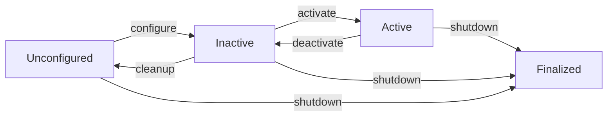

import Callout from '@site/src/components/Callout';
import Quiz from '@site/src/components/Quiz';
import Exercise from '@site/src/components/Exercise';

## Learning Objectives

By the end of this chapter, you will:
- Configure and use rclpy for developing Python-based ROS 2 nodes
- Implement publishers, subscribers, services, and actions using Python
- Integrate Python AI agents with ROS 2 controllers for robotic applications
- Design lifecycle nodes in Python for managed robot operations

## Setting up rclpy Environment

The rclpy client library provides Python bindings for ROS 2, enabling the development of robot applications using Python's rich ecosystem of scientific computing and AI libraries.

For humanoid robotics applications, rclpy serves as a bridge between high-level AI algorithms and low-level robot control systems, facilitating rapid prototyping and integration of intelligent behaviors.

<Callout type="tip" title="Python in Robotics">
Python's extensive library ecosystem makes rclpy particularly suitable for rapid prototyping and experimentation in robotics research, especially for AI integration.
</Callout>

### Getting Started with rclpy

To use rclpy, you need a properly configured ROS 2 environment. The library leverages the underlying rcl (ROS Client Library) to provide access to ROS 2's DDS-based communication infrastructure.

The key advantages of rclpy include:
- Python's ease of use and extensive library ecosystem
- Automatic memory management through Python's garbage collector
- Comprehensive support for all ROS 2 communication patterns (topics, services, actions)
- Seamless integration with Python's scientific computing libraries

<Quiz
  question="Which of the following is a potential performance consideration when using rclpy for real-time humanoid robot control?"
  options={[
    "Python's dynamic typing makes it too slow for robotics",
    "Garbage collection pauses could affect real-time performance",
    "rclpy doesn't support real-time communication patterns",
    "Python cannot interface with hardware drivers"
  ]}
  correctAnswer={1}
  explanation="Python's garbage collector can cause pauses that affect real-time performance in critical robotic applications, requiring careful attention to message allocation and processing."
/>

## Creating Publishers and Subscribers in Python

Implementing publishers and subscribers in rclpy follows a structured approach that mirrors the underlying ROS 2 communication patterns while leveraging Python's object-oriented programming capabilities.

### Basic Publisher Implementation

Here's the basic structure of an rclpy publisher:

```python
import rclpy
from rclpy.node import Node
from std_msgs.msg import String

class MinimalPublisher(Node):
    def __init__(self):
        super().__init__('minimal_publisher')
        self.publisher_ = self.create_publisher(String, 'topic', 10)
        timer_period = 0.5  # seconds
        self.timer = self.create_timer(timer_period, self.timer_callback)
        self.i = 0

    def timer_callback(self):
        msg = String()
        msg.data = f'Hello World: {self.i}'
        self.publisher_.publish(msg)
        self.get_logger().info(f'Publishing: "{msg.data}"')
        self.i += 1

def main(args=None):
    rclpy.init(args=args)
    minimal_publisher = MinimalPublisher()

    try:
        rclpy.spin(minimal_publisher)
    except KeyboardInterrupt:
        pass
    finally:
        minimal_publisher.destroy_node()
        rclpy.shutdown()

if __name__ == '__main__':
    main()
```

For humanoid robots, publishers often handle high-frequency sensor data like IMU readings, joint states, or camera feeds. The publisher implementation must consider the specific requirements of each data type including frequency, size, and criticality for robot safety and performance.

<Exercise
  title="Python Publisher Implementation"
  problem="Create an rclpy publisher node that publishes joint state messages for a humanoid robot arm at 50Hz."
  hints={[
    "Use sensor_msgs.msg.JointState message type",
    "Initialize the ROS 2 context with rclpy.init()",
    "Create a timer to publish at the required frequency"
  ]}
  solution={`import rclpy
from rclpy.node import Node
from sensor_msgs.msg import JointState
import math

class JointPublisher(Node):
    def __init__(self):
        super().__init__('joint_publisher')
        self.publisher = self.create_publisher(JointState, 'joint_states', 10)
        self.timer = self.create_timer(0.02, self.publish_joint_state)  # 50Hz
        self.joint_names = ['shoulder', 'elbow', 'wrist']
        self.i = 0

    def publish_joint_state(self):
        msg = JointState()
        msg.name = self.joint_names
        msg.position = [math.sin(self.i * 0.1), math.cos(self.i * 0.1), 0.0]
        self.publisher.publish(msg)
        self.i += 1

def main(args=None):
    rclpy.init(args=args)
    node = JointPublisher()
    rclpy.spin(node)
    node.destroy_node()
    rclpy.shutdown()`}
/>

### Subscriber Implementation

Subscriber implementations in rclpy utilize callback functions that execute when new messages arrive on subscribed topics. For humanoid robots, these callbacks must execute efficiently to maintain real-time performance, particularly for safety-critical sensor data.

```python
import rclpy
from rclpy.node import Node
from std_msgs.msg import String

class MinimalSubscriber(Node):
    def __init__(self):
        super().__init__('minimal_subscriber')
        self.subscription = self.create_subscription(
            String,
            'topic',
            self.listener_callback,
            10)
        self.subscription  # prevent unused variable warning

    def listener_callback(self, msg):
        self.get_logger().info(f'I heard: "{msg.data}"')

def main(args=None):
    rclpy.init(args=args)
    minimal_subscriber = MinimalSubscriber()

    try:
        rclpy.spin(minimal_subscriber)
    except KeyboardInterrupt:
        pass
    finally:
        minimal_subscriber.destroy_node()
        rclpy.shutdown()

if __name__ == '__main__':
    main()
```

The callback functions should perform minimal processing and delegate complex computations to separate threads or nodes to prevent blocking the message processing loop.

## Implementing Services and Actions in Python

Service and action implementations in rclpy provide synchronous interfaces (services) and asynchronous interfaces (actions) for complex robot operations that require acknowledgment or feedback.

### Service Implementation

Service servers in rclpy implement request-response patterns using callback functions that process incoming service requests and return appropriate responses.

```python
import rclpy
from rclpy.node import Node
from example_interfaces.srv import AddTwoInts

class MinimalService(Node):
    def __init__(self):
        super().__init__('minimal_service')
        self.srv = self.create_service(AddTwoInts, 'add_two_ints', self.add_two_ints_callback)

    def add_two_ints_callback(self, request, response):
        response.sum = request.a + request.b
        self.get_logger().info(f'Returning: {request.a} + {request.b} = {response.sum}')
        return response

def main(args=None):
    rclpy.init(args=args)
    minimal_service = MinimalService()

    try:
        rclpy.spin(minimal_service)
    except KeyboardInterrupt:
        pass
    finally:
        minimal_service.destroy_node()
        rclpy.shutdown()

if __name__ == '__main__':
    main()
```

For humanoid robots, service implementations often handle operations that must complete successfully before proceeding, such as sensor calibration, joint zeroing, or system configuration changes.

<Quiz
  question="What is the primary purpose of services in ROS 2 compared to topics?"
  options={[
    "Services provide faster communication than topics",
    "Services enable publish-subscribe communication patterns",
    "Services provide synchronous request-response communication",
    "Services are only used for sensor data distribution"
  ]}
  correctAnswer={2}
  explanation="Services provide synchronous request-response communication patterns, which are suitable for operations that require acknowledgment and specific results."
/>

### Action Implementation

Action servers in rclpy implement the complete action lifecycle including goal acceptance, execution monitoring, feedback generation, and result delivery.

```python
import rclpy
from rclpy.action import ActionServer
from rclpy.node import Node
from example_interfaces.action import Fibonacci

class FibonacciActionServer(Node):
    def __init__(self):
        super().__init__('fibonacci_action_server')
        self._action_server = ActionServer(
            self,
            Fibonacci,
            'fibonacci',
            self.execute_callback)

    def execute_callback(self, goal_handle):
        self.get_logger().info('Executing goal...')

        feedback_msg = Fibonacci.Feedback()
        feedback_msg.sequence = [0, 1]

        for i in range(1, goal_handle.request.order):
            if feedback_msg.sequence[i] + feedback_msg.sequence[i-1] > 1000:
                goal_handle.abort()
                result = Fibonacci.Result()
                result.sequence = feedback_msg.sequence
                return result

            feedback_msg.sequence.append(feedback_msg.sequence[i] + feedback_msg.sequence[i-1])
            self.get_logger().info(f'Feedback: {feedback_msg.sequence}')
            goal_handle.publish_feedback(feedback_msg)

        goal_handle.succeed()
        result = Fibonacci.Result()
        result.sequence = feedback_msg.sequence
        self.get_logger().info(f'Result: {result.sequence}')
        return result

def main(args=None):
    rclpy.init(args=args)
    fibonacci_action_server = FibonacciActionServer()

    try:
        rclpy.spin(fibonacci_action_server)
    except KeyboardInterrupt:
        pass
    finally:
        fibonacci_action_server.destroy_node()
        rclpy.shutdown()

if __name__ == '__main__':
    main()
```

For humanoid robots, action servers manage complex behaviors like navigation, manipulation, and coordinated motion sequences that require continuous monitoring and potential interruption.

## Integrating Python AI Agents with ROS 2 Controllers

The integration of Python AI agents with ROS 2 controllers is a critical capability for modern humanoid robotics, enabling the deployment of sophisticated machine learning models within real-time robotic systems.

Python's rich ecosystem of AI libraries can be seamlessly integrated with rclpy, including PyTorch, TensorFlow, and scikit-learn, creating intelligent robotic behaviors.

<Callout type="note" title="AI Integration">
AI agent integration typically involves creating specialized ROS 2 nodes that encapsulate machine learning models and provide standard ROS interfaces for other system components.
</Callout>

### AI Integration Patterns

AI agent integration typically involves creating specialized ROS 2 nodes that encapsulate machine learning models and provide standard ROS interfaces for other system components. For humanoid robots, these nodes might implement:

- Perception systems using computer vision models
- Decision-making systems using reinforcement learning agents
- Control systems using learned policies

Performance optimization for AI-ROS integration requires careful consideration of computational resources, memory management, and communication patterns. For humanoid robots operating on embedded platforms, the integration must balance model complexity with available computational resources while maintaining real-time performance for safety-critical operations.

Techniques such as model quantization, batch processing, and asynchronous inference can help optimize performance.

Data flow between AI agents and ROS controllers must be carefully designed to ensure proper synchronization and avoid data races or inconsistencies. For humanoid robots, sensor data must be properly timestamped and synchronized with AI inference results to enable accurate perception and decision-making.

## Lifecycle Nodes in Python

Lifecycle nodes in rclpy provide enhanced control over node initialization, configuration, and shutdown, which is particularly valuable for humanoid robots that require predictable behavior during startup and shutdown sequences.

The lifecycle node pattern enables proper resource management and coordinated system initialization, ensuring that robot systems transition between states safely and predictably.

### Lifecycle Node States

The lifecycle node state machine includes the following states:
- Unconfigured: Initial state after node creation
- Inactive: Node is configured but not active
- Active: Node is running and processing data
- Finalized: Node has been shut down and resources released

There are defined transitions between states that ensure proper resource allocation and deallocation.


*Figure: State transitions in lifecycle nodes*

<Exercise
  title="Lifecycle Node Implementation"
  problem="Create an rclpy lifecycle node that manages a humanoid robot's perception system, handling proper initialization and shutdown."
  hints={[
    "Inherit from LifecycleNode instead of Node",
    "Implement the required lifecycle callbacks",
    "Handle state transitions properly"
  ]}
  solution={`import rclpy
from rclpy.lifecycle import LifecycleNode, LifecycleState
from rclpy.lifecycle import TransitionCallbackReturn
from sensor_msgs.msg import Image

class PerceptionLifecycleNode(LifecycleNode):
    def __init__(self):
        super().__init__('perception_lifecycle_node')
        self.image_subscriber = None
        self.perception_publisher = None

    def on_configure(self, state: LifecycleState):
        self.get_logger().info('Configuring perception node')
        # Initialize resources but don't start processing
        return TransitionCallbackReturn.SUCCESS

    def on_activate(self, state: LifecycleState):
        self.get_logger().info('Activating perception node')
        # Create subscribers/publishers and start processing
        self.image_subscriber = self.create_subscription(
            Image, 'camera/image_raw', self.image_callback, 10
        )
        return super().on_activate(state)

    def on_deactivate(self, state: LifecycleState):
        self.get_logger().info('Deactivating perception node')
        # Stop processing but keep resources
        self.image_subscriber = None
        return super().on_deactivate(state)

    def on_cleanup(self, state: LifecycleState):
        self.get_logger().info('Cleaning up perception node')
        # Release resources
        return TransitionCallbackReturn.SUCCESS

    def image_callback(self, msg):
        # Process image data
        pass

def main(args=None):
    rclpy.init(args=args)
    node = PerceptionLifecycleNode()
    rclpy.spin(node)
    node.destroy_node()
    rclpy.shutdown()`}
/>

Configuration management in lifecycle nodes enables dynamic parameter adjustment and system reconfiguration without requiring node restarts. For humanoid robots, this capability allows for adaptive behavior during operation, such as adjusting control parameters based on environmental conditions or changing operational modes.

Error handling in lifecycle nodes provides structured approaches for managing system failures and recovery. For humanoid robots, the lifecycle node pattern enables graceful degradation and recovery from component failures, which is essential for safe operation in human environments.

## Ethical & Safety Considerations

The integration of AI agents with ROS 2 controllers in humanoid robots raises important ethical and safety considerations:

- The behavior of AI agents must be predictable and controllable to ensure safe operation in human environments
- Proper error handling and safety mechanisms must be implemented to prevent AI-driven behaviors from causing unsafe robot actions
- The transparency of AI decision-making processes is important to maintain human trust and enable appropriate oversight of robot behavior

<Callout type="danger" title="AI Safety">
When integrating AI agents with humanoid robot controllers, ensure proper safety mechanisms are in place to prevent unsafe robot behaviors and maintain human oversight.
</Callout>

## Summary

In this chapter, we've covered writing ROS 2 agents in Python:

- **rclpy** provides Python bindings for ROS 2 with comprehensive support for all communication patterns
- **Python's ecosystem** enables integration of AI algorithms with real-time robot control systems
- **Service and action implementations** in rclpy support complex robot operations with proper error handling
- **Lifecycle nodes** in Python provide enhanced control over node initialization and resource management
- **AI-ROS integration** requires careful performance optimization and data flow management
- **Safety-critical considerations** must be addressed when integrating AI agents with robot controllers

The Python-based ROS 2 development skills covered in this chapter are essential for implementing the AI integration components of humanoid robot systems. The rclpy knowledge you've gained will be used to create intelligent perception, planning, and control systems that integrate machine learning models with real-time robot control. The lifecycle node patterns ensure safe and predictable operation of the complete humanoid robot system.