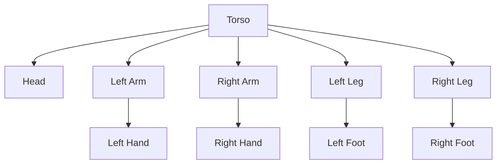

import Callout from '@site/src/components/Callout';
import Quiz from '@site/src/components/Quiz';
import Exercise from '@site/src/components/Exercise';

## Learning Objectives

By the end of this chapter, you will:
- Create comprehensive URDF models for humanoid robot kinematic structures
- Define kinematic chains, joint constraints, and physical properties for humanoid robots
- Configure visual and collision properties for accurate simulation and visualization
- Implement robot state publishing for kinematic awareness in ROS 2 systems

## URDF Fundamentals for Humanoid Robotics

Unified Robot Description Format (URDF) serves as the standard for describing robot kinematic and dynamic properties in ROS-based systems. For humanoid robots, URDF provides a comprehensive framework for modeling complex multi-degree-of-freedom systems with articulated joints, enabling both simulation and real-world control applications.

<Callout type="note" title="URDF Structure">
URDF defines robots as tree-structured kinematic chains with a single base link connected through joints to subsequent links, which is ideal for humanoid robots with their anthropomorphic configurations.
</Callout>

### URDF Components

URDF elements include:

- **Links**: Represent rigid bodies with mass, inertia, and visual/collision properties
- **Joints**: Define the kinematic relationships between links, including joint type, limits, and dynamics
- **Transmissions**: Define the relationship between joints and actuators (for control)

The tree structure ensures that each link has a single parent, which simplifies kinematic calculations while allowing for complex anthropomorphic configurations.

<Quiz
  question="What is the primary structure of URDF kinematic chains?"
  options={[
    "Loop structures with multiple base links",
    "Tree structures with a single base link",
    "Linear chains with no branches",
    "Mesh networks with multiple connections"
  ]}
  correctAnswer={1}
  explanation="URDF defines robots as tree-structured kinematic chains with a single base link connected through joints to subsequent links, ensuring each link has a single parent."
/>

### Basic URDF Structure

Here's a minimal URDF example:

```xml
<?xml version="1.0"?>
<robot name="simple_humanoid">
  <!-- Base link -->
  <link name="base_link">
    <inertial>
      <mass value="1.0" />
      <origin xyz="0 0 0" rpy="0 0 0" />
      <inertia ixx="0.01" ixy="0" ixz="0" iyy="0.01" iyz="0" izz="0.01" />
    </inertial>
    <visual>
      <origin xyz="0 0 0" rpy="0 0 0" />
      <geometry>
        <box size="0.2 0.2 0.2" />
      </geometry>
      <material name="blue">
        <color rgba="0 0 1 1" />
      </material>
    </visual>
    <collision>
      <origin xyz="0 0 0" rpy="0 0 0" />
      <geometry>
        <box size="0.2 0.2 0.2" />
      </geometry>
    </collision>
  </link>
</robot>
```

The XML-based syntax of URDF allows for hierarchical organization of robot components and supports materials, meshes, and complex geometric shapes. For humanoid robots, this enables detailed modeling of anthropomorphic features with realistic joint constraints and physical properties that accurately reflect the robot's real-world behavior.

## Kinematic Chains for Humanoid Robots

Humanoid robot kinematic chains require careful consideration of anthropomorphic joint configurations and motion constraints to achieve human-like movement capabilities. The kinematic structure typically includes a floating base representing the torso with bilateral symmetric chains for arms and legs that mirror human anatomy.

### Torso Chain

The torso chain serves as the central reference frame for the humanoid robot. It typically includes the pelvis, spine, and head as interconnected links. For stability and balance control, the torso chain must be carefully modeled with appropriate mass distribution and inertial properties. The floating base joint allows for 6-degree-of-freedom motion in simulation, providing the foundation for whole-body control algorithms.

<Exercise
  title="URDF Link Definition"
  problem="Define a URDF link for a humanoid robot's torso with appropriate mass, inertia, and visual properties."
  hints={[
    "Use the <link> tag with name attribute",
    "Include <inertial>, <visual>, and <collision> sub-elements",
    "Define mass and inertia matrix"
  ]}
  solution={`<link name="torso">
  <inertial>
    <mass value="5.0" />
    <origin xyz="0 0 0.2" rpy="0 0 0" />
    <inertia ixx="0.1" ixy="0.0" ixz="0.0" iyy="0.1" iyz="0.0" izz="0.1" />
  </inertial>
  <visual>
    <origin xyz="0 0 0.2" rpy="0 0 0" />
    <geometry>
      <box size="0.3 0.2 0.4" />
    </geometry>
    <material name="light_grey">
      <color rgba="0.7 0.7 0.7 1.0" />
    </material>
  </visual>
  <collision>
    <origin xyz="0 0 0.2" rpy="0 0 0" />
    <geometry>
      <box size="0.3 0.2 0.4" />
    </geometry>
  </collision>
</link>`}
/>

### Arm Kinematic Chains

Arm kinematic chains in humanoid robots typically follow human anatomy and include shoulder joints, elbow joints, and wrist joints. The shoulder complex includes multiple degrees of freedom, which enables wide-range motion. The elbow provides flexion/extension, and the wrist adds pronation/supination capabilities.

For manipulation tasks, the kinematic chain extends to include hand models and finger models with appropriate joint limits and coupling mechanisms. The typical structure follows this pattern:

```xml
<link name="shoulder">
  <inertial>...</inertial>
  <visual>...</visual>
  <collision>...</collision>
</link>

<joint name="shoulder_pitch" type="revolute">
  <parent link="torso"/>
  <child link="shoulder"/>
  <origin xyz="0.1 0.2 0.3" rpy="0 0 0"/>
  <axis xyz="1 0 0"/>
  <limit lower="-1.57" upper="1.57" effort="100" velocity="1"/>
</joint>
```

### Leg Kinematic Chains

Leg kinematic chains in humanoid robots mirror human lower extremity anatomy and include hip joints, knee joints, and ankle joints. The hip joint typically includes three degrees of freedom: flexion/extension, abduction/adduction, and internal/external rotation. The knee provides flexion/extension, and the ankle adds dorsiflexion/plantarflexion and inversion/eversion capabilities.

Proper modeling of these chains is essential for achieving stable bipedal locomotion. The hip joint provides the primary support for the robot's weight, while the knee and ankle joints provide the necessary motion for walking and balance.


*Figure: Structure of a humanoid robot with torso, arms, and legs*

## Visual and Collision Properties

Visual and collision properties in URDF define how robots appear in simulation environments and how they interact with their surroundings. For humanoid robots, these properties must accurately represent aesthetic appearance and physical interaction characteristics to ensure realistic simulation and visualization.

### Visual Properties

Visual properties include geometric shapes, materials, and mesh models that define the robot's appearance in visualization tools like RViz2. For humanoid robots, visual properties often utilize detailed mesh models to achieve anthropomorphic appearance while maintaining computational efficiency.

Materials define color, texture, and lighting properties that enhance the visual representation during simulation and debugging. You can define materials in a separate section of your URDF:

```xml
<material name="blue">
  <color rgba="0 0 1 1"/>
</material>
<material name="red">
  <color rgba="1 0 0 1"/>
</material>
```

<Callout type="tip" title="Visual vs Collision">
For computational efficiency, visual models can be detailed while collision models use simplified geometric shapes like boxes, cylinders, and spheres.
</Callout>

### Collision Properties

Collision properties define the geometric shapes used for physics simulation and collision detection. For humanoid robots, collision properties typically use simplified geometric approximations of the visual model to maintain real-time performance during physics simulation.

Common shapes include:
- Boxes for simple rectangular components
- Cylinders for limbs and joints
- Spheres for rounded components
- Capsules for limb segments that need rounded ends

These approximate the robot's physical form and provide stable collision detection. The relationship between visual and collision properties affects both the appearance and behavior of humanoid robots in simulation.

Visual properties focus on realistic appearance, while collision properties prioritize computational efficiency and stability. For humanoid robots, this balance is critical for achieving realistic visualization and stable physics simulation during complex locomotion and manipulation tasks.

## Robot State Publishing and TF Trees

The robot state publisher is a critical ROS 2 node that transforms URDF kinematic models into real-time joint state transformations for visualization and control. For humanoid robots with numerous joints, the state publisher maintains the complete kinematic tree and publishes transformation matrices that enable accurate spatial reasoning and visualization.

<Quiz
  question="What does the robot state publisher primarily transform?"
  options={[
    "URDF models into joint state messages",
    "Joint state messages into TF transformations",
    "TF transformations into URDF models",
    "Joint positions into velocity commands"
  ]}
  correctAnswer={1}
  explanation="The robot state publisher subscribes to joint state messages and calculates forward kinematics to publish transformation (TF) trees representing the current configuration of the robot."
/>

### Robot State Publisher Node

The robot state publisher subscribes to joint state messages and calculates forward kinematics to publish transformation (TF) trees that represent the current configuration of the robot. For humanoid robots, this requires processing dozens of joint angles to maintain accurate spatial relationships between all robot components.

The TF tree enables other ROS nodes to perform spatial reasoning and coordinate transformations necessary for perception, planning, and control. Joint state messages provide the input data for robot state publishing and are typically generated by robot controllers or simulation environments.

For humanoid robots, joint state messages must include all actuated joints with accurate timing and synchronization to maintain proper kinematic relationships. The state publisher handles both static transforms (published once) and dynamic transforms (published at appropriate frequencies).

### Example Robot State Publisher Launch

```python
from launch import LaunchDescription
from launch.actions import DeclareLaunchArgument
from launch.substitutions import LaunchConfiguration
from launch_ros.actions import Node

def generate_launch_description():
    return LaunchDescription([
        DeclareLaunchArgument(
            'use_sim_time',
            default_value='false',
            description='Use simulation (Gazebo) clock if true'),

        Node(
            package='robot_state_publisher',
            executable='robot_state_publisher',
            name='robot_state_publisher',
            output='screen',
            parameters=[{
                'use_sim_time': LaunchConfiguration('use_sim_time'),
                'robot_description': open('path/to/robot.urdf').read()
            }])
    ])
```

The integration of URDF models with robot state publishing enables real-time visualization of humanoid robot motion in RViz2 and spatial awareness required for complex robotic behaviors. The TF tree published by the robot state publisher serves as the foundation for spatial reasoning throughout the ROS system, enabling perception, planning, and control nodes to operate with consistent spatial references.

## Ethical & Safety Considerations

The accuracy of URDF models in humanoid robotics has important ethical and safety implications. Inaccurate kinematic models can lead to unsafe robot behaviors during simulation-based planning and control development.

Proper collision modeling is essential to ensure that simulated safety behaviors translate accurately to real-world operation. Additionally, the anthropomorphic appearance of humanoid robots raises ethical questions about human-robot interaction that must be considered during design and deployment.

<Callout type="danger" title="Model Accuracy">
Ensure URDF models accurately represent the physical robot to prevent unsafe behaviors that could result from discrepancies between simulation and reality.
</Callout>

## Summary

In this chapter, we've covered URDF for humanoid kinematic modeling:

- **URDF** provides the standard framework for describing robot kinematic and dynamic properties in ROS systems
- **Humanoid robot kinematic chains** require careful modeling of anthropomorphic joint configurations and constraints
- **Visual and collision properties** must balance realistic appearance with computational efficiency for simulation
- **Robot state publishing** transforms URDF models into real-time TF trees for visualization and spatial reasoning
- **Accurate URDF modeling** is critical for both simulation fidelity and real-world robot control
- **Safety considerations** require accurate collision modeling and kinematic constraints in URDF descriptions

The URDF modeling skills covered in this chapter are essential for creating the digital twin of your humanoid robot for simulation. The kinematic models you develop here will be used in Gazebo simulation to provide the foundation for perception, planning, and control algorithms. The robot state publishing techniques enable real-time visualization and spatial reasoning for the complete autonomous humanoid system.