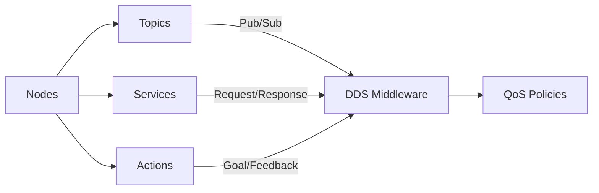

import Callout from '@site/src/components/Callout';
import Quiz from '@site/src/components/Quiz';
import Exercise from '@site/src/components/Exercise';

## Learning Objectives

By the end of this module, you will:
- Understand the architecture of ROS 2 and its role in real-time robot control
- Master the fundamental communication patterns in ROS 2 (nodes, topics, services, actions)
- Apply design principles that make ROS 2 suitable for humanoid robotics applications
- Implement basic ROS 2 nodes for humanoid robot systems

## Introduction to ROS 2 as the Robotic Nervous System

ROS 2 (Robot Operating System 2) serves as the central nervous system for humanoid robots, orchestrating complex interactions between sensors, actuators, and cognitive systems. Think of ROS 2 as the neural network that connects all parts of your robot, enabling them to communicate and work together seamlessly.

Unlike a simple communication bus, ROS 2 provides a sophisticated middleware architecture that enables distributed computation across multiple processes and machines. This is critical for humanoid robots with numerous sensors and actuators requiring real-time coordination. Whether your robot is walking, grasping objects, or responding to voice commands, ROS 2 ensures all components work in harmony.

The architecture of ROS 2 is fundamentally based on the Data Distribution Service (DDS) standard, which provides a publisher-subscriber communication model with Quality of Service (QoS) policies. This design allows for reliable communication in safety-critical applications, supporting various delivery guarantees including best-effort, reliable, and transient-local durability. For humanoid robotics, where real-time performance is essential, these QoS policies enable precise control over message delivery, latency, and reliability based on the specific requirements of each subsystem.

ROS 2's node-based architecture allows for modular development where each robot capability (e.g., localization, perception, planning, control) can be implemented as a separate node. This modular approach is particularly beneficial for humanoid robots, which integrate numerous complex subsystems that must work together seamlessly. Each node can be developed, tested, and maintained independently, yet integrated through standardized interfaces.

<Callout type="info" title="Key Concept">
ROS 2 is not an operating system but rather a collection of tools, libraries, and conventions that provide a framework for building robot applications. It handles communication between different parts of your robot, making it easier to develop complex robotic systems.
</Callout>

## Core Architecture Components

### Nodes
In ROS 2, a node is a fundamental computational unit that performs specific robot functionality. For humanoid robots, nodes might include sensor drivers, control algorithms, perception modules, and planning systems. Each node is implemented as a separate process, providing fault isolation and enabling distribution across multiple computing units. This is particularly important for humanoid robots, which often require multiple processing units to handle the computational demands of perception, planning, and control simultaneously.

Nodes are the building blocks of your robot's software. They can be written in different programming languages (primarily C++ and Python) and can run on the same computer or distributed across multiple machines. This flexibility allows you to optimize each component for its specific requirements.

### Topics and Publishers/Subscribers
Topics in ROS 2 enable asynchronous communication through a publish-subscribe pattern. This communication model is ideal for sensor data distribution, where multiple consumers (e.g., perception, localization, and control nodes) need access to the same sensor streams. For humanoid robots, this pattern is commonly used for IMU data, camera feeds, joint state information, and laser scan data.

The publish-subscribe pattern works like a newspaper system: nodes publish information to topics, and other nodes subscribe to those topics to receive the information. This decouples the publisher from the subscriber, meaning they don't need to know about each other directly. This makes your robot's software more modular and easier to maintain.

### Services and Actions
While topics provide asynchronous communication, services enable synchronous request-response patterns suitable for operations that require acknowledgment and result delivery. For humanoid robots, services might be used for calibration routines, configuration changes, or state queries. When you request a service, you wait for a response before continuing.

Actions extend services with support for long-running operations with feedback, making them ideal for navigation goals, manipulation tasks, or complex behaviors that provide progress updates. Actions are perfect for operations that take time to complete and need to provide feedback during execution.

<Quiz
  question="Which communication pattern is best suited for distributing sensor data to multiple consumer nodes in a humanoid robot?"
  options={[
    "Services",
    "Topics",
    "Actions",
    "Parameters"
  ]}
  correctAnswer={1}
  explanation="Topics use a publish-subscribe pattern that allows multiple consumer nodes to receive the same sensor data stream simultaneously, which is ideal for sensor data distribution in humanoid robots."
/>

## Design Principles for Humanoid Robotics

ROS 2 was specifically redesigned to address the limitations of ROS 1 for commercial and safety-critical applications, making it particularly suitable for humanoid robotics. Key design principles include:

1. **Real-time performance**: Through DDS integration and improved threading models, ROS 2 supports deterministic behavior required for humanoid robot control loops.

2. **Security**: Built-in security features including authentication, encryption, and access control are essential for humanoid robots operating in human environments.

3. **Multi-robot systems**: Native support for multi-robot communication allows for coordinated humanoid robot teams.

4. **Cross-platform compatibility**: Support for various operating systems and architectures enables deployment across diverse hardware platforms.

5. **Quality of Service (QoS)**: Configurable policies for message delivery that allow fine-tuning based on application requirements.

6. **Lifecycle management**: Enhanced node state management for safety-critical applications.

<Callout type="tip" title="Pro Tip">
When designing ROS 2 nodes for humanoid robots, consider the computational requirements of each node. Some nodes like perception or planning may require more powerful processors, while others like sensor drivers can run on less powerful embedded systems.
</Callout>

## Quality of Service (QoS) Policies

QoS policies are a critical feature of ROS 2 that allow you to fine-tune communication characteristics based on your application's needs. For humanoid robots, different types of data have different requirements:

- **Reliability**: Choose between best-effort (faster, may lose messages) or reliable (slower, ensures delivery)
- **Durability**: Volatile (new subscribers don't get old messages) vs. transient-local (new subscribers get latest message)
- **History**: Keep-all (store all messages) vs. keep-last (store only recent messages)

For example, IMU data critical for balance control requires reliable delivery and low latency, while camera feeds for perception might tolerate best-effort delivery with higher latency.

*Figure: The core components of ROS 2 and how they interact through the DDS middleware layer*

## Practical Example: Creating Your First Node

Let's look at a simple example of a ROS 2 node that publishes joint states for a humanoid robot:

<Exercise
  title="ROS 2 Node Implementation"
  problem="Create a simple ROS 2 node that publishes joint states for a humanoid robot. The node should publish position, velocity, and effort for each joint at 50Hz."
  hints={[
    "Use the sensor_msgs/JointState message type",
    "Remember to initialize the ROS 2 context with rclpy.init()",
    "Set appropriate QoS settings for real-time joint state publishing"
  ]}
  solution={`import rclpy
from rclpy.node import Node
from sensor_msgs.msg import JointState
import math

class JointStatePublisher(Node):
    def __init__(self):
        super().__init__('joint_state_publisher')
        self.publisher = self.create_publisher(JointState, 'joint_states', 10)
        timer_period = 0.02  # 50Hz
        self.timer = self.create_timer(timer_period, self.timer_callback)

    def timer_callback(self):
        msg = JointState()
        msg.name = ['joint1', 'joint2', 'joint3']
        msg.position = [math.sin(self.get_clock().now().nanoseconds * 1e-9),
                       math.cos(self.get_clock().now().nanoseconds * 1e-9),
                       0.0]
        self.publisher.publish(msg)

def main(args=None):
    rclpy.init(args=args)
    joint_publisher = JointStatePublisher()
    rclpy.spin(joint_publisher)
    joint_publisher.destroy_node()
    rclpy.shutdown()`}
/>

This example demonstrates the basic structure of a ROS 2 node that publishes joint state information. The node creates a publisher for the 'joint_states' topic and uses a timer to publish messages at 50Hz, which is typical for joint state information in humanoid robots.

## Module 1: Building Your Foundation for Humanoid Robotics

Now that you understand the fundamental concepts of ROS 2, let's explore how these concepts connect to build a complete humanoid robotics system. Module 1 is structured to provide you with a progressive learning path that builds from basic concepts to advanced implementations:

1. **Chapter 1: ROS 2 Nodes** - Establishes the foundational understanding of nodes, topics, services, and actions that form the backbone of all ROS 2 applications.

2. **Chapter 2: Advanced Communication Patterns** - Delves deeper into Quality of Service (QoS) policies and advanced service and action implementations that are critical for real-time humanoid robot systems.

3. **Chapter 3: Writing ROS 2 Agents in Python** - Teaches you how to implement the communication patterns using Python's rclpy library, with special focus on integrating AI agents with ROS 2 controllers.

4. **Chapter 4: URDF for Humanoid Kinematic Modeling** - Shows you how to create digital representations of your robot's physical structure, which is essential for simulation and control.

5. **Chapter 5: Lifecycle Nodes and Composition** - Covers advanced node management patterns that ensure safe and predictable behavior during startup, operation, and shutdown of humanoid robots.

Each chapter builds upon the previous one, creating a comprehensive understanding of how to design and implement a complete humanoid robot system using ROS 2. As you progress through these chapters, you'll see how the concepts connect to form the "nervous system" of your robot.

## Ethical & Safety Considerations

The design of robotic communication systems raises important ethical and safety considerations, particularly for humanoid robots that interact closely with humans. The reliability of ROS 2's communication infrastructure directly impacts robot safety - communication failures between perception and control nodes could lead to dangerous robot behavior. Additionally, the distributed nature of ROS 2 systems introduces security vulnerabilities that must be carefully managed, especially as humanoid robots become more prevalent in human environments.

<Callout type="danger" title="Safety Critical">
Communication failures in ROS 2 can have serious safety implications for humanoid robots. Always implement appropriate fallback behaviors and safety mechanisms to handle communication disruptions.
</Callout>

## Summary

Module 1 has introduced you to the fundamental concepts of ROS 2, the middleware that serves as the nervous system for humanoid robots:

- **ROS 2** provides the central communication infrastructure for coordinating complex robot subsystems
- **Nodes, topics, services, and actions** form the core communication patterns that enable modular robot software development
- **Quality of Service (QoS) policies** allow fine-tuning of communication characteristics for specific robot requirements
- **The modular architecture** enables independent development and testing of robot capabilities
- **Safety and security** considerations are built into the ROS 2 architecture for humanoid robot applications

These foundational concepts will be extended in the following chapters as you dive deeper into specific aspects of ROS 2 programming for humanoid robotics. Understanding these principles is essential for building safe, reliable, and maintainable humanoid robot systems.

As you continue with the subsequent chapters, you'll see how these foundational concepts apply to real-world humanoid robotics applications, from writing Python agents to modeling robot kinematics and managing complex system lifecycles.