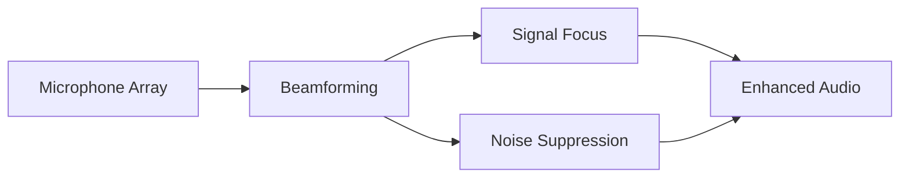
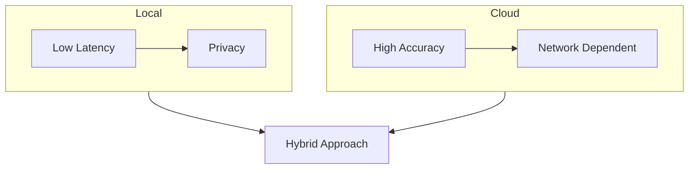
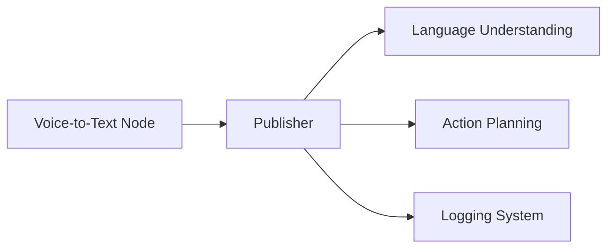

import Callout from '@site/src/components/Callout';
import Quiz from '@site/src/components/Quiz';
import Exercise from '@site/src/components/Exercise';

import Toggle from '@site/src/components/Toggle';

# Voice-to-Text Integration

## Learning Objectives

- Implement real-time speech recognition using OpenAI Whisper for humanoid robots
- Apply noise reduction and audio processing techniques for robust performance
- Compare local vs cloud-based ASR approaches for different deployment scenarios
- Integrate voice-to-text systems with ROS 2 messaging infrastructure

## Real-time Speech Recognition with Whisper

OpenAI Whisper provides state-of-the-art automatic speech recognition capabilities that are particularly well-suited for humanoid robot applications due to its robustness across different accents, speaking styles, and audio conditions. For humanoid robots, Whisper's multilingual capabilities and ability to handle disfluencies make it an ideal choice for natural human-robot interaction.

<Callout type="tip" title="Whisper for Robotics">
Whisper's robustness across different accents and speaking styles makes it well-suited for humanoid robot applications, with multilingual capabilities supporting diverse interaction scenarios.
</Callout>

Real-time speech recognition implementation for humanoid robots requires careful optimization of the Whisper model to achieve acceptable latency while maintaining accuracy. The implementation must balance computational requirements with the need for responsive interaction. For Jetson-based humanoid robots, this involves optimizing the model for GPU inference and implementing efficient audio processing pipelines.

*Figure: Whisper model optimization for real-time inference on Jetson platforms*

Whisper model variants offer different trade-offs between speed and accuracy, ranging from tiny models suitable for edge deployment to large models for maximum accuracy. For humanoid robots, the choice of model variant depends on the computational resources available and the required recognition accuracy. The tiny.en or base.en models are often suitable for real-time edge deployment.

<Exercise
  title="Whisper Model Selection"
  problem="Implement a Whisper-based ASR system for a humanoid robot and compare different model variants for speed vs accuracy trade-offs."
  hints={[
    "Evaluate tiny, base, and medium Whisper models",
    "Measure latency and accuracy on your target hardware",
    "Consider memory and computational constraints"
  ]}
  solution={`# Example Whisper model selection and implementation
import whisper
import rospy
from std_msgs.msg import String
import time

class WhisperASR:
    def __init__(self, model_size="tiny"):
        # Load Whisper model based on computational requirements
        self.model = whisper.load_model(model_size)

    def transcribe_audio(self, audio_path):
        start_time = time.time()
        result = self.model.transcribe(audio_path)
        latency = time.time() - start_time

        rospy.loginfo(f"Transcription: {result['text']}, Latency: {latency:.2f}s")
        return result['text']

# Example usage for different model sizes
tiny_asr = WhisperASR("tiny")
base_asr = WhisperASR("base")
# Compare performance across different models`}
/>

Streaming recognition techniques enable continuous speech processing without requiring complete utterances, which improves the naturalness of human-robot interaction. For humanoid robots, streaming recognition allows for more natural conversation patterns and reduces the perceived latency between speech and response. The implementation must handle partial results and maintain context across streaming segments.

<Quiz
  question="What is a key advantage of using Whisper for humanoid robot applications?"
  options={[
    "Lower computational requirements",
    "Robustness across different accents and speaking styles with multilingual capabilities",
    "Better integration with ROS 2",
    "Reduced memory usage"
  ]}
  correctAnswer="Robustness across different accents and speaking styles with multilingual capabilities"
  explanation="Whisper's robustness across different accents, speaking styles, and its multilingual capabilities make it well-suited for natural human-robot interaction in diverse environments."
/>

### Concrete Examples
- Example: Implementing Whisper tiny.en model for real-time voice command recognition on Jetson
- Example: Streaming recognition processing continuous speech without waiting for complete utterances

## Noise Reduction and Audio Processing

Audio preprocessing is critical for humanoid robots operating in noisy environments where motor noise, fan noise, and environmental sounds can significantly impact speech recognition accuracy. Effective preprocessing involves noise reduction, echo cancellation, and audio enhancement techniques that are tailored to the specific acoustic challenges of robotic platforms.

<Callout type="warning" title="Audio Preprocessing">
For humanoid robots, audio preprocessing is critical as motor noise, fan noise, and environmental sounds can significantly impact speech recognition accuracy in real-world environments.
</Callout>

Beamforming techniques using microphone arrays can enhance the signal-to-noise ratio by focusing on the speaker's voice while suppressing background noise. For humanoid robots, beamforming can be particularly effective when the robot can estimate the speaker's location relative to the robot. The implementation must account for the robot's own movement and consider the resulting changes in acoustic conditions.

*Figure: Microphone array beamforming focusing on speaker while suppressing background noise*

Real-time noise reduction algorithms must operate with minimal latency to maintain the responsiveness required for natural interaction. For humanoid robots, this includes adaptive noise cancellation that can adjust to changing acoustic conditions. The algorithms must distinguish between stationary background noise and transient sounds that might be relevant to the robot's operation.

<Exercise
  title="Noise Reduction Implementation"
  problem="Implement noise reduction techniques to filter robot motor and fan noise during speech recognition."
  hints={[
    "Use spectral subtraction or Wiener filtering techniques",
    "Implement adaptive noise cancellation",
    "Consider the robot's own acoustic signature"
  ]}
  solution={`# Example noise reduction implementation
import numpy as np
import pyaudio
import scipy.signal as signal
import rospy
from std_msgs.msg import String

class NoiseReduction:
    def __init__(self):
        # Initialize audio stream parameters
        self.rate = 16000  # Sampling rate
        self.chunk = 1024  # Audio chunk size
        self.noise_buffer = []
        self.noise_samples = 100  # Number of samples to estimate noise

    def estimate_noise_profile(self, audio_chunk):
        # Estimate noise profile during known quiet periods
        self.noise_buffer.append(audio_chunk)
        if len(self.noise_buffer) > self.noise_samples:
            self.noise_buffer.pop(0)

    def reduce_noise(self, audio_chunk):
        # Apply spectral subtraction for noise reduction
        if len(self.noise_buffer) == 0:
            return audio_chunk

        # Compute average noise spectrum
        noise_spectrum = np.mean([np.abs(np.fft.fft(chunk)) for chunk in self.noise_buffer], axis=0)

        # Apply spectral subtraction
        audio_spectrum = np.fft.fft(audio_chunk)
        enhanced_spectrum = audio_spectrum - 0.5 * noise_spectrum  # Alpha parameter for noise reduction
        enhanced_audio = np.real(np.fft.ifft(enhanced_spectrum))

        return enhanced_audio.astype(np.int16)`}
/>

Audio format optimization ensures that the audio data is processed efficiently while maintaining the quality required for accurate speech recognition. For humanoid robots, this includes appropriate sampling rates, bit depths, and channel configurations that balance quality with computational efficiency. The optimization must also consider the specific requirements of the ASR system being used.

### Concrete Examples
- Example: Implementing noise reduction to filter out robot motor and fan noise during speech recognition
- Example: Using microphone array beamforming to focus on speaker's voice in noisy environment

<Quiz
  question="What is the primary purpose of beamforming in humanoid robot audio systems?"
  options={[
    "To increase microphone sensitivity",
    "To focus on the speaker's voice while suppressing background noise",
    "To improve audio quality only",
    "To reduce power consumption"
  ]}
  correctAnswer="To focus on the speaker's voice while suppressing background noise"
  explanation="Beamforming techniques using microphone arrays enhance the signal-to-noise ratio by focusing on the speaker's voice while suppressing background noise, which is critical for humanoid robots operating in noisy environments."
/>

## Local vs Cloud-based ASR Approaches

Local ASR implementation on humanoid robots provides privacy, reduced latency, and independence from network connectivity. This makes it suitable for safety-critical applications and environments with limited connectivity. The local approach ensures that voice data remains on the robot, which addresses privacy concerns while providing consistent performance regardless of network conditions.

<Callout type="note" title="Local vs Cloud ASR">
Local ASR provides privacy and reduced latency but requires more computational resources, while cloud-based ASR offers superior accuracy but introduces network dependency and privacy concerns.
</Callout>

Cloud-based ASR services offer superior accuracy and continuous model updates but require reliable network connectivity and raise privacy concerns. For humanoid robots, cloud-based ASR can provide better recognition accuracy, especially for complex commands or specialized vocabularies. However, the approach introduces network latency and dependency on external services.

*Figure: Comparison of local vs cloud-based ASR with privacy, latency, and accuracy trade-offs*

Hybrid approaches combine local and cloud-based ASR to leverage the benefits of both approaches. For humanoid robots, this might involve using local ASR for simple commands and safety-critical functions while using cloud services for complex language understanding or specialized domains. The hybrid approach requires careful management of data flow and consistency.

<Exercise
  title="Hybrid ASR Implementation"
  problem="Implement a hybrid ASR system that uses local ASR for safety-critical commands and cloud services for complex vocabulary."
  hints={[
    "Implement command classification to determine processing approach",
    "Use local ASR for emergency commands",
    "Use cloud ASR for complex language understanding"
  ]}
  solution={`# Example hybrid ASR implementation
import whisper
import rospy
import requests
from std_msgs.msg import String

class HybridASR:
    def __init__(self):
        # Initialize local Whisper model
        self.local_model = whisper.load_model("tiny")
        self.safety_keywords = ["stop", "emergency", "help", "danger", "caution"]

    def transcribe(self, audio_data):
        # Classify command type
        local_result = self.local_model.transcribe(audio_data)

        # Check if it's a safety-related command
        if any(keyword in local_result['text'].lower() for keyword in self.safety_keywords):
            # Use local result for safety commands
            rospy.loginfo(f"Local ASR result for safety command: {local_result['text']}")
            return local_result['text']
        else:
            # Use cloud ASR for complex commands if available
            try:
                cloud_result = self.cloud_transcribe(audio_data)
                if cloud_result and len(cloud_result) > len(local_result['text']):
                    return cloud_result
            except:
                rospy.logwarn("Cloud ASR unavailable, using local result")

            return local_result['text']

    def cloud_transcribe(self, audio_data):
        # Example implementation for cloud ASR service
        # This would connect to services like Google Speech-to-Text, Azure Speech, etc.
        pass`}
/>

Edge optimization techniques enable sophisticated ASR models to run efficiently on humanoid robot platforms. This includes model quantization, pruning, and specialized inference engines that maximize performance on resource-constrained hardware. For Jetson-based robots, TensorRT optimization can significantly improve ASR performance.

### Concrete Examples
- Example: Local ASR for safety-critical commands like "stop" or "emergency" to ensure immediate response
- Example: Cloud-based ASR for complex vocabulary or specialized domains requiring high accuracy

<Quiz
  question="What is a key advantage of local ASR implementation for humanoid robots?"
  options={[
    "Higher accuracy than cloud-based systems",
    "Reduced latency and privacy, independence from network connectivity",
    "Lower computational requirements",
    "Continuous model updates"
  ]}
  correctAnswer="Reduced latency and privacy, independence from network connectivity"
  explanation="Local ASR provides privacy, reduced latency, and independence from network connectivity, making it suitable for safety-critical applications and environments with limited connectivity."
/>

## Integration with ROS 2 Messaging

ROS 2 messaging integration enables voice-to-text systems to communicate with other robot components through standard ROS 2 topics, services, and actions. For humanoid robots, this integration allows speech recognition results to trigger appropriate responses and actions throughout the robot's software stack.

<Callout type="tip" title="ROS 2 Integration">
ROS 2 messaging integration allows speech recognition results to trigger appropriate responses and actions throughout the robot's software stack, enabling seamless communication between components.
</Callout>

Custom message types for speech recognition results provide structured data including the recognized text, confidence scores, timestamps, and metadata about the recognition process. For humanoid robots, these messages enable downstream systems to make informed decisions about how to handle the recognized commands based on confidence levels and other quality indicators.

*Figure: ROS 2 messaging architecture with voice-to-text publisher and multiple subscribers*

Publisher-subscriber patterns enable multiple robot components to receive speech recognition results simultaneously. For humanoid robots, this allows the language understanding system, attention mechanisms, and other components to respond to voice input in parallel. The pattern also supports the distribution of recognition results to monitoring and logging systems.

<Exercise
  title="ROS 2 Voice-to-Text Node"
  problem="Implement a ROS 2 node that publishes voice recognition results to multiple subscribers."
  hints={[
    "Create a custom message type for speech recognition results",
    "Implement publisher-subscriber pattern",
    "Include confidence scores and metadata"
  ]}
  solution={`# Example ROS 2 voice-to-text node implementation
import rclpy
from rclpy.node import Node
from std_msgs.msg import String
from sensor_msgs.msg import AudioData
import whisper
import json

class VoiceToTextNode(Node):
    def __init__(self):
        super().__init__('voice_to_text_node')

        # Create publisher for recognized text
        self.text_pub = self.create_publisher(String, 'recognized_text', 10)

        # Create subscription for audio data
        self.audio_sub = self.create_subscription(
            AudioData,
            'audio_input',
            self.audio_callback,
            10
        )

        # Initialize Whisper model
        self.model = whisper.load_model("tiny")

    def audio_callback(self, msg):
        # Process audio data and perform speech recognition
        # This is a simplified example - real implementation would need to handle audio format conversion
        try:
            # For demonstration, we'll use a placeholder audio file
            # In practice, you'd convert msg.data to proper audio format
            result = self.model.transcribe("audio_file.wav")  # Placeholder

            # Create and publish result message
            text_msg = String()
            text_msg.data = result['text']
            self.text_pub.publish(text_msg)

            self.get_logger().info(f'Recognized: {result["text"]}')
        except Exception as e:
            self.get_logger().error(f'ASR error: {e}')

def main(args=None):
    rclpy.init(args=args)
    node = VoiceToTextNode()

    try:
        rclpy.spin(node)
    except KeyboardInterrupt:
        pass
    finally:
        node.destroy_node()
        rclpy.shutdown()

if __name__ == '__main__':
    main()`}
/>

Service-based interfaces provide synchronous access to speech recognition capabilities for components that require immediate results. For humanoid robots, this might include safety systems that need to respond immediately to specific voice commands or emergency situations. The service interface must maintain low latency and provides reliable recognition results.

### Concrete Examples
- Example: Voice recognition node publishing commands to language understanding and action planning nodes
- Example: Service interface for immediate safety response to emergency voice commands

<Quiz
  question="What is the primary purpose of custom message types in ROS 2 voice-to-text integration?"
  options={[
    "To reduce computational requirements",
    "To provide structured data including recognized text, confidence scores, and metadata",
    "To improve audio quality",
    "To increase network speed"
  ]}
  correctAnswer="To provide structured data including recognized text, confidence scores, and metadata"
  explanation="Custom message types for speech recognition results provide structured data including the recognized text, confidence scores, timestamps, and metadata, enabling downstream systems to make informed decisions based on recognition quality."
/>

## Forward References to Capstone Project

The voice-to-text integration covered in this chapter forms the foundation. This is for natural language interaction in your Autonomous Humanoid capstone project.

The Whisper implementation will enable your robot to understand spoken commands. The noise reduction techniques will ensure robust performance in real-world environments. The ROS 2 integration will provide the communication infrastructure. This connects voice input with your robot's action execution systems.

## Ethical & Safety Considerations

The implementation of voice-to-text systems in humanoid robots raises important ethical and safety considerations. These relate to privacy, consent, and appropriate use of voice data.

<Callout type="danger" title="Privacy and Consent">
Voice-to-text systems must be designed with clear privacy policies and user consent mechanisms, especially when operating in personal or sensitive environments, with safeguards against unauthorized voice commands.
</Callout>

The system must be designed with clear privacy policies and user consent mechanisms, especially when operating in personal or sensitive environments. Additionally, the system should include safeguards against unauthorized voice commands and provides users with control over voice data collection and processing.

## Key Takeaways

- OpenAI Whisper provides robust speech recognition capabilities for humanoid robot interaction
- Audio preprocessing and noise reduction are critical for performance in robotic environments
- Local ASR offers privacy and reliability while cloud-based ASR provides higher accuracy
- ROS 2 messaging integration enables seamless communication with other robot components
- Real-time processing requirements must balance accuracy with responsiveness
- Privacy considerations require careful handling of voice data and user consent

