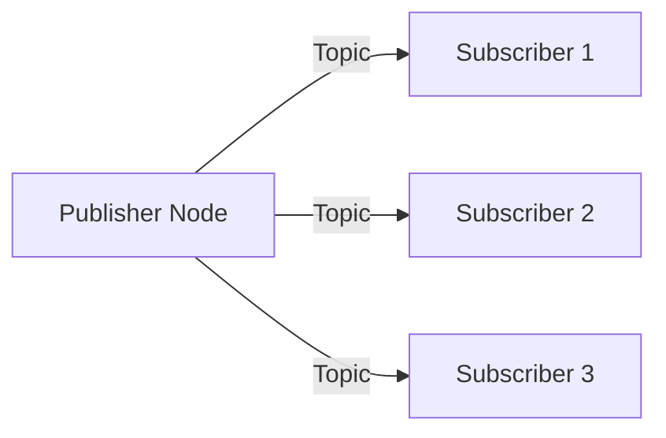

# Implementation Plan: Textbook MDX Compliance (UI/UX Refactor)

**Branch**: `001-textbook-mdx-compliance` | **Date**: 2025-12-29 | **Spec**: [spec.md](./spec.md)
**Input**: Feature specification from `/specs/001-textbook-mdx-compliance/spec.md`

## Summary

Refactor the Docusaurus textbook to achieve 100% MDX compliance with mobile-first responsive design, dark mode optimization, native Mermaid diagrams (replacing 62 custom `<Diagram>` components), and elimination of 26 conversion artifacts. The plan establishes a complete visual identity for an educational textbook while preserving all technical content accuracy.

**Key Metrics**:
- 62 custom `<Diagram>` components to convert to Mermaid
- 26 "Diagram Description:" artifacts to remove
- 21 MDX files across 4 modules to update
- 0 Mermaid diagrams currently exist (all new)

## Technical Context

**Language/Version**: TypeScript 5.x, MDX 3.x, React 18.x
**Primary Dependencies**: Docusaurus 3.x, @docusaurus/theme-mermaid, Infima CSS framework
**Storage**: N/A (static site)
**Testing**: Visual regression testing, viewport testing (320px, 375px, 414px), WCAG AA contrast validation
**Target Platform**: Static site (GitHub Pages), all modern browsers, mobile-first
**Project Type**: Web application (frontend-only for this feature)
**Performance Goals**: Build completes in <5 minutes, no client-side JS required for content viewing
**Constraints**: SSG-only (all content pre-rendered at build time), WCAG AA contrast ratios
**Scale/Scope**: 21 MDX files across 4 modules, 62 diagrams to convert, landing page refinement

## Constitution Check

*GATE: All items PASS*

| Principle | Status | Notes |
|-----------|--------|-------|
| Scientific Accuracy | PASS | Content unchanged; only visual presentation affected |
| Academic Clarity | PASS | Typography improvements enhance readability |
| Reproducibility & Transparency | PASS | Diagrams will be clearer with Mermaid |
| Ethical & Safety Awareness | PASS | Not affected by visual changes |
| Module Structure Compliance | PASS | 4-module structure preserved verbatim |
| Visual Standards & Diagrams | IN SCOPE | Primary focus of this feature |
| Typography & Readability | IN SCOPE | Primary focus of this feature |
| Landing Page Requirements | IN SCOPE | Primary focus of this feature |
| Frontend Architecture | PASS | Docusaurus with native Mermaid (no custom components) |
| Change Control | PASS | Module names/structure unchanged |

## Project Structure

### Documentation (this feature)

```text
specs/001-textbook-mdx-compliance/
├── plan.md              # This file
├── spec.md              # Feature specification
├── checklists/
│   └── requirements.md  # Quality validation checklist
├── research.md          # Research findings
├── data-model.md        # Data model documentation
├── quickstart.md        # Quick start guide
└── contracts/           # API contracts (N/A for this feature)
```

### Source Code (repository root)

```text
frontend/
├── docusaurus.config.ts     # Add Mermaid plugin configuration
├── src/
│   ├── css/
│   │   ├── custom.css       # Dark mode, typography variables
│   │   ├── readability.css  # Enhanced (mobile-first, textbook hierarchy)
│   │   └── diagrams.css     # NEW: Mermaid responsive styles
│   ├── pages/
│   │   ├── index.tsx        # Landing page refinement
│   │   └── index.module.css # Landing page responsive styles
│   └── components/
│       ├── Diagram/         # DELETE: Remove custom Diagram component
│       └── HomepageFeatures/ # Module cards (existing)
├── docs/
│   ├── ros2-nervous-system/ # Module 1 (6 files, ~12 diagrams)
│   ├── digital-twin/        # Module 2 (5 files, ~13 diagrams)
│   ├── ai-robot-brain/      # Module 3 (5 files, ~19 diagrams)
│   └── vla/                 # Module 4 (5 files, ~18 diagrams)
└── static/
    └── img/                 # Static images (unchanged)
```

**Structure Decision**: Frontend-only changes within existing Docusaurus structure. No backend impact.

---

## Architecture Decisions

### 1. Diagram Architecture (Mermaid-Only Strategy)

**Decision**: Replace all 62 custom `<Diagram>` components with native Mermaid syntax.

**Rationale**:
- Constitution v1.3.0 mandates Mermaid-first policy
- Native Docusaurus Mermaid plugin provides automatic dark/light theme switching
- SVG pre-rendering at build time ensures SSG compliance
- No custom components means no maintenance burden

**Implementation Pattern**:

```mdx
{/* BEFORE: Custom component (PROHIBITED) */}
<Diagram
  title="Topic Communication Pattern"
  description="Publisher-subscriber model..."
  width="600"
  height="300"
/>

{/* AFTER: Native Mermaid with caption */}
```

````markdown

*Figure: Publisher-subscriber model with multiple subscribers receiving the same published data*
````

**Complexity Constraints** (per clarification):
- Maximum 5-10 nodes per diagram
- Clear labels (no abbreviations without definition)
- Basic styling only (colors for emphasis, not decoration)
- Mobile-optimized (horizontal layouts preferred over vertical for narrow screens)

**Conversion Decision Tree**:
1. Is the concept visualizable as a flow, sequence, or relationship? → Convert to Mermaid
2. Is it a data structure or architecture? → Convert to Mermaid (flowchart or class diagram)
3. Is it too abstract or conceptual? → Convert to explanatory prose
4. Does it require >10 nodes to be accurate? → Simplify or split into multiple diagrams

### 2. Content Cleanup Strategy for Conversion Artifacts

**Decision**: Systematic search-and-remove for all known artifact patterns.

**Artifact Patterns to Remove**:

| Pattern | Count | Action |
|---------|-------|--------|
| `<Diagram ... />` components | 62 | Replace with Mermaid or prose |
| "Diagram Description:" text | 26 | Remove entirely |
| "Figure shows:" patterns | TBD | Remove entirely |
| Empty diagram blocks | TBD | Remove entirely |
| Orphan diagram references | TBD | Remove or add corresponding diagram |

**Validation Build Check**:
```bash
# Add to build process
grep -rn "Diagram Description:" frontend/docs/ && exit 1
grep -rn "<Diagram" frontend/docs/ && exit 1
grep -rn "Figure shows:" frontend/docs/ && exit 1
```

### 3. Typography and Dark Mode Design Decisions

**Decision**: Extend existing CSS with mobile-first, dark-mode-optimized typography.

**Typography Variables** (to add to custom.css):
```css
:root {
  /* Textbook typography */
  --ifm-font-size-base: 16px;
  --ifm-line-height-base: 1.65;
  --ifm-heading-font-weight: 600;

  /* Touch targets */
  --ifm-button-size-min: 44px;

  /* Spacing rhythm */
  --ifm-spacing-vertical: 1.5rem;
}

[data-theme='dark'] {
  /* Avoid pure white on pure black */
  --ifm-font-color-base: #e4e4e7;
  --ifm-background-color: #18181b;

  /* Mermaid dark theme override */
  --mermaid-bg-color: transparent;
  --mermaid-text-color: #e4e4e7;
}
```

**Visual Hierarchy** (textbook-style, not API docs):
- h1: Chapter titles, prominent, scannable
- h2: Major sections with generous top margin
- h3: Subsections with moderate spacing
- Callouts: Visually distinct backgrounds
- Key definitions: Highlighted inline or in callout blocks

### 4. Mobile Responsiveness Approach

**Decision**: Mobile-first CSS with progressive enhancement.

**Breakpoints**:
- 320px: Minimum supported (small phones)
- 375px: Standard mobile
- 414px: Large mobile
- 768px: Tablet
- 1024px+: Desktop

**Responsive Diagram Strategy**:
```css
/* diagrams.css */
.mermaid {
  max-width: 100%;
  overflow-x: auto;
  -webkit-overflow-scrolling: touch;
}

@media (max-width: 480px) {
  .mermaid {
    font-size: 12px;
  }

  /* Allow horizontal scroll for complex diagrams */
  .mermaid svg {
    min-width: 300px;
  }
}
```

**Content Overflow Prevention**:
- Code blocks: `overflow-x: auto` with visible scrollbar
- Tables: Wrapped in scrollable container
- Images: `max-width: 100%`
- Mermaid: Horizontal scroll container on mobile

### 5. Introduction / Landing Page Structure

**Decision**: Refine existing landing page to emphasize textbook identity.

**Current State Analysis**:
- Title: "Physical AI & Humanoid Robotics" ✓
- Tagline: "AI Systems in the Physical World: Embodied Intelligence" ✓
- Module cards: Present but styled as buttons (not textbook-style cards)

**Target Structure**:
```
┌─────────────────────────────────────────────────────┐
│ HERO SECTION                                         │
│ ┌─────────────────────────────────────────────────┐ │
│ │ Physical AI & Humanoid Robotics                 │ │
│ │ AI Systems in the Physical World                │ │
│ │                                                 │ │
│ │ [Brief textbook introduction paragraph]         │ │
│ └─────────────────────────────────────────────────┘ │
├─────────────────────────────────────────────────────┤
│ MODULE CARDS (2x2 grid on desktop, 1 column mobile) │
│ ┌───────────────┐ ┌───────────────┐                 │
│ │ Module 1      │ │ Module 2      │                 │
│ │ ROS 2         │ │ Digital Twin  │                 │
│ │ [icon/visual] │ │ [icon/visual] │                 │
│ │ 5 chapters    │ │ 5 chapters    │                 │
│ └───────────────┘ └───────────────┘                 │
│ ┌───────────────┐ ┌───────────────┐                 │
│ │ Module 3      │ │ Module 4      │                 │
│ │ NVIDIA Isaac  │ │ VLA           │                 │
│ │ [icon/visual] │ │ [icon/visual] │                 │
│ │ 4 chapters    │ │ 5 chapters    │                 │
│ └───────────────┘ └───────────────┘                 │
└─────────────────────────────────────────────────────┘
```

**Module Card Requirements**:
- Full module names (verbatim from constitution)
- Chapter count
- Visual distinction (icons or color coding)
- Responsive: 2x2 on desktop → single column on mobile
- Touch-friendly: 44px minimum touch targets

---

## Files and Directories Impacted

### Files to Modify

| File | Change Type | Description |
|------|-------------|-------------|
| `frontend/docusaurus.config.ts` | Modify | Add Mermaid plugin configuration |
| `frontend/src/css/custom.css` | Modify | Add typography variables, dark mode colors |
| `frontend/src/css/readability.css` | Modify | Mobile-first responsive typography |
| `frontend/src/pages/index.tsx` | Modify | Refine landing page structure |
| `frontend/src/pages/index.module.css` | Modify | Module card grid layout |
| `frontend/docs/**/*.mdx` (21 files) | Modify | Replace Diagram components with Mermaid |

### Files to Create

| File | Description |
|------|-------------|
| `frontend/src/css/diagrams.css` | Mermaid responsive styles |
| `frontend/scripts/validate-content.sh` | Build-time artifact validation |

### Files to Delete

| File | Reason |
|------|--------|
| `frontend/src/components/Diagram/` | Custom component prohibited by constitution |

### Directories Unchanged

| Directory | Reason |
|-----------|--------|
| `backend/` | No backend changes in this feature |
| `frontend/static/` | Static assets unchanged |

---

## Explicit Non-Goals (Scope Boundaries)

To prevent scope creep, the following are explicitly **OUT OF SCOPE**:

1. **Backend Changes**: No modifications to FastAPI, RAG chatbot, or Qdrant
2. **Content Rewriting**: Only visual presentation changes; technical content unchanged
3. **New Chapters**: No new content creation; only existing content refinement
4. **Quiz/Exercise Components**: Existing interactive components preserved as-is
5. **Urdu Translation**: Translation toggle functionality unchanged
6. **Personalization**: Personalization toggle functionality unchanged
7. **Blog Section**: Blog pages not in scope
8. **Custom React Components**: No new custom components (Mermaid-only)
9. **Performance Optimization**: Beyond SSG compliance, no performance work
10. **SEO Optimization**: Meta tags and social cards unchanged
11. **Analytics**: No analytics integration
12. **Search Functionality**: Docusaurus search unchanged

---

## Safety Considerations for Static Site Generation

### Build-Time Validation

**Pre-Build Checks**:
1. Grep for prohibited patterns (fail build if found)
2. Validate all Mermaid syntax parses correctly
3. Verify no orphan diagram references

**Build Process**:
1. Mermaid diagrams pre-rendered to SVG at build time
2. No client-side JavaScript required for diagram viewing
3. Theme switching (light/dark) handled by CSS, not JS

### Regression Prevention

**Automated Checks** (add to CI/build):
```bash
#!/bin/bash
# validate-content.sh

# Check for conversion artifacts
if grep -rn "Diagram Description:" frontend/docs/; then
  echo "ERROR: Found 'Diagram Description:' artifacts"
  exit 1
fi

if grep -rn "<Diagram" frontend/docs/; then
  echo "ERROR: Found custom <Diagram> components"
  exit 1
fi

if grep -rn "Figure shows:" frontend/docs/; then
  echo "ERROR: Found 'Figure shows:' placeholder text"
  exit 1
fi

echo "Content validation passed"
```

### Rollback Strategy

- All changes are CSS and MDX content (no database)
- Git revert possible for any commit
- No breaking changes to external APIs
- Docusaurus build will fail on MDX syntax errors (safe)

---

## Docusaurus Mermaid Configuration

**Add to docusaurus.config.ts**:
```typescript
const config = {
  // ... existing config ...

  markdown: {
    mermaid: true,
  },
  themes: ['@docusaurus/theme-mermaid'],

  themeConfig: {
    // ... existing themeConfig ...
    mermaid: {
      theme: {
        light: 'default',
        dark: 'dark',
      },
      options: {
        maxTextSize: 50000,
        securityLevel: 'loose',
      },
    },
  },
};
```

**Install Dependency**:
```bash
npm install @docusaurus/theme-mermaid
```

---

## Complexity Tracking

> No Constitution violations requiring justification.

| Check | Status | Notes |
|-------|--------|-------|
| Custom components | REMOVED | Diagram component deleted per constitution |
| Module structure | PRESERVED | All 4 modules unchanged |
| Technical accuracy | PRESERVED | Content unchanged |
| Build process | EXTENDED | Added validation scripts |

---

## Research Summary

### Docusaurus Mermaid Plugin

**Finding**: `@docusaurus/theme-mermaid` is the official plugin.
- Supports automatic dark/light theme switching via `theme.light` and `theme.dark` config
- Pre-renders diagrams to SVG at build time (SSG compliant)
- Requires `markdown.mermaid: true` in config

### WCAG AA Contrast Requirements

**Finding**: Minimum contrast ratios:
- Normal text (< 24px): 4.5:1
- Large text (≥ 24px or 18.66px bold): 3:1
- UI components: 3:1

**Implication**: Dark mode must avoid pure white (#FFFFFF) on pure black (#000000).
- Recommended: #e4e4e7 text on #18181b background (contrast ~14:1)

### Mobile Viewport Testing

**Finding**: Standard breakpoints for testing:
- 320px: iPhone SE, small Android
- 375px: iPhone 12 mini, standard
- 414px: iPhone 12 Pro Max, large phones

**Implication**: All diagrams must be tested at 320px minimum.

---

## Next Steps

This plan is complete. Proceed to `/sp.tasks` to generate the actionable task list.

**Do NOT implement yet** - tasks must be generated first.
