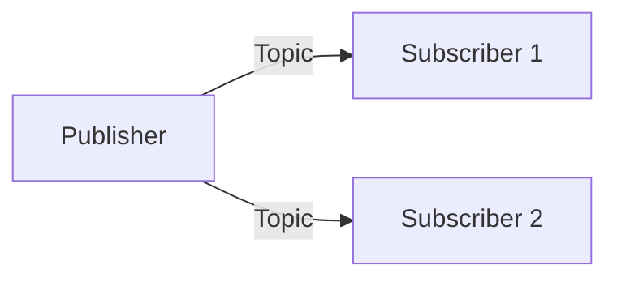

# Implementation Tasks: Textbook MDX Compliance (UI/UX Refactor)

**Feature**: textbook-mdx-compliance | **Date**: 2025-12-29 | **Plan**: [plan.md](./plan.md)

## Task Generation Summary

- **Total Tasks**: 67
- **User Story Tasks**: US1 (Mobile): 8, US2 (Dark Mode): 6, US3 (Diagrams): 25, US4 (Artifacts): 6, US5 (Visual Hierarchy): 5, US6 (Landing Page): 5
- **Setup & Foundational Tasks**: 12
- **Parallel Opportunities**: All diagram conversions per module can run in parallel
- **MVP Scope**: Phase 1-3 (Setup + Foundation + Mobile Responsiveness)
- **Estimated Build Validation Points**: After each phase completion

---

## Phase 1: Setup

**Purpose**: Install dependencies and configure Mermaid plugin

- [x] T001 Install @docusaurus/theme-mermaid package in frontend/package.json
- [x] T002 Add Mermaid plugin configuration to frontend/docusaurus.config.ts (markdown.mermaid: true, themes array)
- [x] T003 Add Mermaid theme config to themeConfig in frontend/docusaurus.config.ts
- [x] T004 [P] Create frontend/src/css/diagrams.css with Mermaid responsive styles
- [x] T005 [P] Import diagrams.css in frontend/docusaurus.config.ts customCss array
- [x] T006 Verify Docusaurus build succeeds with Mermaid plugin configured

**Checkpoint**: Build completes with Mermaid plugin enabled

---

## Phase 2: Foundational (Blocking Prerequisites)

**Purpose**: CSS infrastructure that MUST be complete before content changes

**CRITICAL**: No content changes can begin until this phase is complete

- [x] T007 [P] Add textbook typography variables to frontend/src/css/custom.css (:root section)
- [x] T008 [P] Add dark mode color variables to frontend/src/css/custom.css ([data-theme='dark'] section)
- [x] T009 [P] Update frontend/src/css/readability.css with mobile-first base styles (16px, line-height 1.65)
- [x] T010 [P] Add mobile breakpoint styles to frontend/src/css/readability.css (@media max-width: 480px)
- [x] T011 [P] Add touch target minimum size styles to frontend/src/css/readability.css (44px)
- [x] T012 Create frontend/scripts/validate-content.sh for build-time artifact validation

**Checkpoint**: CSS foundation ready - content work can begin

---

## Phase 3: User Story 1 - Mobile-First Content Consumption (Priority: P1) 🎯 MVP

**Goal**: All content readable on 320px viewport without horizontal scrolling

**Independent Test**: Load any chapter at 320px viewport width, verify no horizontal scroll

### Implementation for User Story 1

- [x] T013 [US1] Add overflow-x handling for code blocks in frontend/src/css/readability.css
- [x] T014 [US1] Add overflow-x handling for tables in frontend/src/css/readability.css
- [x] T015 [US1] Add max-width: 100% for images in frontend/src/css/readability.css
- [x] T016 [US1] Add horizontal scroll container styles for Mermaid in frontend/src/css/diagrams.css
- [x] T017 [US1] Update navigation touch targets in frontend/src/css/custom.css
- [ ] T018 [US1] Test all 4 module intro pages at 320px viewport
- [ ] T019 [US1] Test landing page at 320px viewport
- [ ] T020 [US1] Verify build succeeds and no horizontal overflow at mobile viewports

**Checkpoint**: Mobile responsiveness complete - US1 independently testable

---

## Phase 4: User Story 2 - Dark Mode Reading Experience (Priority: P2)

**Goal**: WCAG AA contrast in dark mode, no pure white on pure black

**Independent Test**: Switch to dark mode, verify all text and diagrams have proper contrast

### Implementation for User Story 2

- [x] T021 [US2] Update dark mode text color to #e4e4e7 in frontend/src/css/custom.css
- [x] T022 [US2] Update dark mode background to #18181b in frontend/src/css/custom.css
- [x] T023 [US2] Verify Mermaid dark theme configuration in frontend/docusaurus.config.ts
- [x] T024 [US2] Update code block dark mode styling in frontend/src/css/readability.css
- [ ] T025 [US2] Test dark mode contrast across all chapter types
- [ ] T026 [US2] Verify build succeeds with dark mode optimizations

**Checkpoint**: Dark mode complete - US2 independently testable

---

## Phase 5: User Story 3 - Diagram Clarity and Rendering (Priority: P3)

**Goal**: Replace 62 custom `<Diagram>` components with native Mermaid + captions

**Independent Test**: View any chapter, verify diagrams render as Mermaid graphics with captions

### Module 1: The Robotic Nervous System (6 files, ~12 diagrams)

- [x] T027 [P] [US3] Convert diagrams to Mermaid in frontend/docs/ros2-nervous-system/intro.mdx
- [x] T028 [P] [US3] Convert diagrams to Mermaid in frontend/docs/ros2-nervous-system/01-ros2-nodes.mdx
- [x] T029 [P] [US3] Convert diagrams to Mermaid in frontend/docs/ros2-nervous-system/02-ros2-topics-services-actions.mdx
- [x] T030 [P] [US3] Convert diagrams to Mermaid in frontend/docs/ros2-nervous-system/03-writing-ros2-agents-python.mdx
- [x] T031 [P] [US3] Convert diagrams to Mermaid in frontend/docs/ros2-nervous-system/04-urdf-kinematic-modeling.mdx
- [x] T032 [P] [US3] Convert diagrams to Mermaid in frontend/docs/ros2-nervous-system/05-lifecycle-nodes-composition.mdx

### Module 2: The Digital Twin (5 files, ~13 diagrams)

- [x] T033 [P] [US3] Convert diagrams to Mermaid in frontend/docs/digital-twin/intro.mdx
- [x] T034 [P] [US3] Convert diagrams to Mermaid in frontend/docs/digital-twin/01-rigid-body-dynamics-gazebo.mdx
- [x] T035 [P] [US3] Convert diagrams to Mermaid in frontend/docs/digital-twin/02-sensor-simulation.mdx
- [x] T036 [P] [US3] Convert diagrams to Mermaid in frontend/docs/digital-twin/03-unity-high-fidelity-env.mdx
- [x] T037 [P] [US3] Convert diagrams to Mermaid in frontend/docs/digital-twin/04-synchronizing-gazebo-unity.mdx

### Module 3: The AI-Robot Brain (5 files, ~19 diagrams)

- [x] T038 [P] [US3] Convert diagrams to Mermaid in frontend/docs/ai-robot-brain/intro.mdx
- [x] T039 [P] [US3] Convert diagrams to Mermaid in frontend/docs/ai-robot-brain/01-synthetic-data-generation.mdx
- [x] T040 [P] [US3] Convert diagrams to Mermaid in frontend/docs/ai-robot-brain/02-isaac-ros-gems.mdx
- [x] T041 [P] [US3] Convert diagrams to Mermaid in frontend/docs/ai-robot-brain/03-nav2-bipedal-navigation.mdx
- [x] T042 [P] [US3] Convert diagrams to Mermaid in frontend/docs/ai-robot-brain/04-edge-inference-jetson.mdx

### Module 4: Vision-Language-Action (5 files, ~18 diagrams)

- [x] T043 [P] [US3] Convert diagrams to Mermaid in frontend/docs/vla/intro.mdx
- [x] T044 [P] [US3] Convert diagrams to Mermaid in frontend/docs/vla/01-voice-to-text-whisper.mdx
- [x] T045 [P] [US3] Convert diagrams to Mermaid in frontend/docs/vla/02-llm-task-decomposition.mdx
- [x] T046 [P] [US3] Convert diagrams to Mermaid in frontend/docs/vla/03-grounding-language-ros2.mdx
- [x] T047 [P] [US3] Convert diagrams to Mermaid in frontend/docs/vla/04-capstone-end-to-end.mdx

### Diagram Component Cleanup

- [x] T048 [US3] Remove Diagram import statements from all MDX files
- [x] T049 [US3] Delete frontend/src/components/Diagram/ directory (stub removed, no longer needed)
- [x] T050 [US3] Verify build succeeds with all Mermaid diagrams rendering
- [x] T051 [US3] Verify all diagrams have captions (italic text below each diagram)

**Checkpoint**: All diagrams converted - US3 independently testable

---

## Phase 6: User Story 4 - Clean Content Without Artifacts (Priority: P4)

**Goal**: Zero instances of conversion artifacts across all content

**Independent Test**: Grep for "Diagram Description:" returns zero matches

### Implementation for User Story 4

- [x] T052 [US4] Remove all "Diagram Description:" text from frontend/docs/**/*.mdx
- [x] T053 [US4] Remove all "Figure shows:" placeholder text from frontend/docs/**/*.mdx
- [x] T054 [US4] Remove empty or commented-out diagram blocks from frontend/docs/**/*.mdx
- [x] T055 [US4] Remove orphan diagram references from frontend/docs/**/*.mdx
- [x] T056 [US4] Run frontend/scripts/validate-content.sh to verify zero artifacts
- [x] T057 [US4] Verify build succeeds with all artifacts removed

**Checkpoint**: Artifacts removed - US4 independently testable

---

## Phase 7: User Story 5 - Consistent Visual Hierarchy (Priority: P5)

**Goal**: Textbook-style visual hierarchy with clear heading distinction

**Independent Test**: Read any chapter, verify h1 > h2 > h3 visual distinction

### Implementation for User Story 5

- [x] T058 [US5] Add heading hierarchy styles to frontend/src/css/readability.css
- [x] T059 [US5] Add section whitespace styles to frontend/src/css/readability.css
- [x] T060 [US5] Add callout/definition distinct styles to frontend/src/css/readability.css
- [x] T061 [US5] Add chapter title prominent styles to frontend/src/css/readability.css
- [ ] T062 [US5] Verify visual hierarchy across all chapter types

**Checkpoint**: Visual hierarchy complete - US5 independently testable

---

## Phase 8: User Story 6 - Introductory Landing Page (Priority: P6)

**Goal**: Landing page with textbook identity and module navigation cards

**Independent Test**: Load root URL, verify title, subtitle, and 4 module cards present

### Implementation for User Story 6

- [x] T063 [US6] Refine hero section in frontend/src/pages/index.tsx (add textbook intro paragraph)
- [x] T064 [US6] Convert module buttons to cards in frontend/src/pages/index.tsx
- [x] T065 [US6] Add 2x2 grid layout for module cards in frontend/src/pages/index.module.css
- [x] T066 [US6] Add mobile single-column layout for module cards in frontend/src/pages/index.module.css
- [ ] T067 [US6] Verify landing page responsive at 320px, 768px, 1024px viewports

**Checkpoint**: Landing page complete - US6 independently testable

---

## Phase 9: Polish & Final Validation

**Purpose**: Cross-cutting validation and build verification

- [ ] T068 Run frontend/scripts/validate-content.sh to verify zero artifacts
- [ ] T069 Run Docusaurus build to verify zero MDX/JSX errors
- [ ] T070 Verify all 21 MDX files render without errors
- [ ] T071 Test mobile viewport (320px) across all modules
- [ ] T072 Test dark mode across all modules
- [ ] T073 Verify all Mermaid diagrams have captions
- [ ] T074 Final landing page validation at all breakpoints

**Checkpoint**: All validation passed - feature complete

---

## Dependencies & Execution Order

### Phase Dependencies

```
Phase 1 (Setup) ──────────────────┐
                                  ▼
Phase 2 (Foundational) ───────────┤ BLOCKS ALL USER STORIES
                                  │
                                  ▼
┌─────────────────────────────────┴─────────────────────────────────┐
│                   USER STORIES (can run in parallel)              │
├───────────────────────────────────────────────────────────────────┤
│  US1 (Mobile)  │  US2 (Dark Mode)  │  US3 (Diagrams)  │  US4-6   │
│  Phase 3       │  Phase 4          │  Phase 5         │  Phase 6-8│
└───────────────────────────────────────────────────────────────────┘
                                  │
                                  ▼
                    Phase 9 (Polish & Validation)
```

### Within Phase 5 (Diagrams)

- All module diagram conversions (T027-T047) can run in parallel
- T048-T051 depend on all diagram conversions completing

### Parallel Opportunities

```bash
# All diagram conversions can run in parallel:
T027, T028, T029, T030, T031, T032  # Module 1
T033, T034, T035, T036, T037        # Module 2
T038, T039, T040, T041, T042        # Module 3
T043, T044, T045, T046, T047        # Module 4

# All CSS tasks in Phase 2 can run in parallel:
T007, T008, T009, T010, T011

# All mobile overflow tasks can run in parallel:
T013, T014, T015, T016, T017
```

---

## Implementation Strategy

### MVP First (User Story 1 Only)

1. Complete Phase 1: Setup (T001-T006)
2. Complete Phase 2: Foundational (T007-T012)
3. Complete Phase 3: User Story 1 - Mobile (T013-T020)
4. **STOP and VALIDATE**: Test at 320px viewport
5. Deploy/demo if ready

### Incremental Delivery

| Increment | Phases | Deliverable |
|-----------|--------|-------------|
| MVP | 1-3 | Mobile-responsive foundation |
| +Dark Mode | +4 | WCAG AA compliant dark mode |
| +Diagrams | +5 | All 62 diagrams converted to Mermaid |
| +Clean | +6 | Zero conversion artifacts |
| +Hierarchy | +7 | Textbook visual hierarchy |
| +Landing | +8 | Textbook identity landing page |
| Complete | +9 | Full validation |

### Parallel Team Strategy

With multiple developers/agents:
1. Team completes Phase 1-2 together
2. Once Phase 2 done:
   - Agent A: US1 (Mobile)
   - Agent B: US2 (Dark Mode)
   - Agent C: US3 Module 1-2 diagrams
   - Agent D: US3 Module 3-4 diagrams
3. US4-6 can follow in parallel after dependencies met

---

## Conversion Guidelines for Diagram Tasks

When executing diagram conversion tasks (T027-T047):

1. **Find** the `<Diagram>` component in the file
2. **Extract** the `title` and `description` props
3. **Create** a Mermaid diagram based on the description:
   - Use `graph LR` for horizontal flows (mobile-friendly)
   - Maximum 5-10 nodes
   - Clear labels without abbreviations
4. **Add** a caption below the diagram: `*Figure: [description]*`
5. **Remove** the `<Diagram>` component
6. **Remove** the `import Diagram from '@site/src/components/Diagram';` line if no more diagrams

Example conversion:
```mdx
{/* BEFORE */}
<Diagram
  title="Topic Communication"
  description="Publisher-subscriber model"
/>

{/* AFTER */}

*Figure: Publisher-subscriber model with multiple subscribers*
```

---

## Notes

- [P] tasks = different files, no dependencies, can run in parallel
- [US#] label maps task to specific user story for traceability
- Verify tests (build) fail before implementing each phase
- Commit after each completed phase
- Stop at any checkpoint to validate story independently
